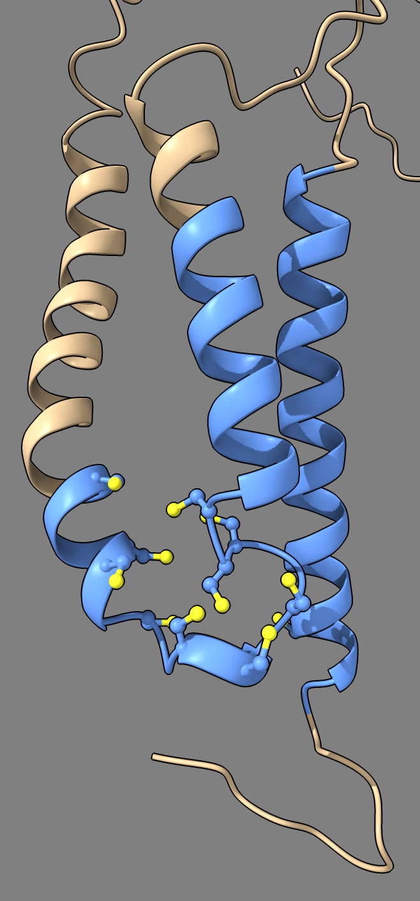

# Search AlphaFold database for transmembrane cysteines

This is an example of searching the C elegans proteome for transmembrane proteins that have at least two nearby cysteines.  This uses AlphaFold database predicted structures and UniProt annotations to identify transmembrane residues.  It searches 19827 UniProt entries for C elegans, finds 5756 with annotated transmembrane regions, and then finds 783 proteins with two cysteines in the transmembrane region closer than 5 Angstroms to each other (SG to SG atom distance).  The search takes 36 seconds on a Mac laptop, so it is feasible to try many variations of this kind of structural feature search in a short time.

## UniProt Data

In order to make the search fast we download in advance the [UniProt annotations for all C elegans proteins](https://ftp.uniprot.org/pub/databases/uniprot/current_release/knowledgebase/reference_proteomes/Eukaryota/UP000001940/UP000001940_6239.xml.gz) as a single XML file (193 Mbytes).  The [C elegans proteome](https://www.uniprot.org/proteomes/UP000001940) is described here

    https://www.uniprot.org/proteomes/UP000001940

and the XML file is here

    https://ftp.uniprot.org/pub/databases/uniprot/current_release/knowledgebase/reference_proteomes/Eukaryota/UP000001940/UP000001940_6239.xml.gz

## AlphaFold database structures

We also download all of the AlphaFold database structures for C elegans in advance (2.6 Gbytes) described [here](https://alphafold.com/download)

    https://alphafold.com/download

and the file is [here](https://ftp.ebi.ac.uk/pub/databases/alphafold/latest/UP000001940_6239_CAEEL_v4.tar)

    https://ftp.ebi.ac.uk/pub/databases/alphafold/latest/UP000001940_6239_CAEEL_v4.tar

We put the structures in a directory called alphafold_models and uncompress them

    mkdir alphafold_models
    cd alphafold_models
    tar xf ~/Downloads/UP000001940_6239_CAEEL_v4.tar --include '*.cif.gz'
    gunzip *.gz

## Running the search in ChimeraX

Opening the Python script [cyssearch.py](cyssearch.py) in ChimeraX 1.7 then does the search and prints the results to the log.  The script uses standard Python capabilities to read the UniProt annotation XML file, and uses ChimeraX capabilities to read the AlphaFold structures to measure distances between cysteines.

Use ChimeraX commands to change to the directory with the UniProt XML file, Python script and alphafold_models directory, then open the script in ChimeraX.

    cd ~/af_search
    open cyssearch.py

The following [output](results.txt) is logged listing the UniProt ids with pairs of cysteines and also a short list of structures for which there was no AlphaFold model (too new 2022 or too large >1400 amino acids for AlphaFold database).

    19827 UniProt entries
    5756 entries with annotated transmembrane regions
    4518 entries with 1 or more transmembrane cysteines
    783 with two cysteines closer than 5A, at least 1 being transmembrane

    O16978 209,260
    O17230 137,210
    O17956 93,97 76,84
    O17960 47,91
    O18083 17,306 99,153
    Q18595 123,468
    Q19061 85,93
    Q65XS8 243,302
    Q9NA41 149,204
    A0A067XG43 63,259
    A4UVM0 150,216
    Q86D06 138,180
    Q8WQB6 37,309
    E5QCI3 177,217
    O16880 634,638
    P34315 17,388
    Q19975 47,55
    Q93655 280,531
    Q966F7 18,189
    Q9GYL0 145,165
    O45767 162,181 33,72
    Q9U3P2 1103,1107
    G5ED82 141,145 254,323
    O16494 97,153
    O45971 54,107
    Q7YWW4 37,41
    Q9GYP2 75,77 72,75 71,83 77,78 71,73 72,78 71,86 73,83 72,77
    ...

    No alphafold model for 44 entries with transmembrane regions:
    A0A8S4SQM5 502
    Q9UB28 4450
    A0A8D9MJW7 973
    A0A8D9J776 335
    ...

## Example structure

Here is an image of the protein Q9GYP2, an uncharacterized protein with a cluster 11 closely spaced cysteines near transmembrane helices.

## Python script

Here is the ChimeraX Python script that does the search [cyssearch.py](cyssearch.py)

    # Dengke Ma wants to find all C elegans proteins with pairs of close cysteines in transmembrane regions.
    # Can use UniProt to identify transmembrane residues, then use AlphaFold database predicted structures
    # to see if there are close cysteines.

    def find_uniprot_transmembrane_cysteines(uniprot_xml_path, namespace = '{http://uniprot.org/uniprot}'):
        import xml.etree.ElementTree as ET
        tree = ET.parse(uniprot_xml_path)
        tm = []
        for child in tree.getroot():
            if child.tag == namespace + 'entry':
                rr = transmembrane_residue_ranges(child, namespace)
                uniprot_id = child.find(namespace + 'accession').text
                seq = child.find(namespace + 'sequence').text
                cys_count = ''.join(seq[b-1:e] for b,e in rr).count('C')
                tm.append((uniprot_id, cys_count, len(seq), rr))
        return tm

    def transmembrane_residue_ranges(protein_xml_entry, namespace):
        ranges = []
        for feature in protein_xml_entry.iter(namespace + 'feature'):
            fattrib = feature.attrib
            if 'type' in fattrib and fattrib['type'] == 'transmembrane region':
                for loc in feature.iter(namespace + 'location'):
                    b,e = loc.find(namespace + 'begin'), loc.find(namespace + 'end')
                    if b is not None and e is not None:
                        if 'position' in b.attrib and 'position' in e.attrib:
                            r = (int(b.attrib['position']), int(e.attrib['position']))
                            ranges.append(r)
        return ranges

    def close_cysteines(structure, membrane_residue_ranges, max_distance = 5):
        cys_res = [r for r in structure.residues if r.name == 'CYS']
        cys_xyz = [(r.number, r.find_atom('SG').coord) for r in cys_res]

        mb_res_nums = set()
        for b,e in membrane_residue_ranges:
            for rnum in range(b,e+1):
                mb_res_nums.add(rnum)

        mb_cys = [r for r in cys_res if r.number in mb_res_nums]
        mb_xyz = [(r.number, r.find_atom('SG').coord) for r in mb_cys]

        close_pairs = set()
        from chimerax.geometry import distance
        for rnum, xyz in mb_xyz:
            for rnum2, xyz2 in cys_xyz:
                if rnum2 != rnum and distance(xyz, xyz2) <= max_distance:
                    pair = (rnum, rnum2) if rnum < rnum2 else (rnum2, rnum)
                    close_pairs.add(pair)

        return list(close_pairs)

    def check_for_close_cysteines(session, ulist, alphafold_dir, max_distance):
        found = []
        missing = []
        for uniprot_id, ncys, seq_len, tm_res_ranges in ulist:
            if ncys == 0:
                continue
            m = alphafold_database_model(session, uniprot_id, alphafold_dir)
            if m is None:
                missing.append((uniprot_id, seq_len))
                continue
            close_pairs = close_cysteines(m, tm_res_ranges, max_distance)
            if close_pairs:
                found.append((uniprot_id, close_pairs))
            m.delete()
        return found, missing

    def alphafold_database_model(session, uniprot_id, alphafold_dir):
        filename = f'AF-{uniprot_id}-F1-model_v4.cif'
        from os.path import join, exists
        path = join(alphafold_dir, filename)
        if not exists(path):
            return None
        from chimerax.mmcif import open_mmcif
        s, msg = open_mmcif(session, path)
        return s[0]

    uniprot_xml_path = 'UP000001940_6239.xml'
    alphafold_dir = 'alphafold_models'
    max_distance = 5

    ulist = find_uniprot_transmembrane_cysteines(uniprot_xml_path)
    uclose, missing = check_for_close_cysteines(session, ulist, alphafold_dir, max_distance)
    ntm = len([uniprot_id for uniprot_id, ncys, seq_len, tm_res_ranges in ulist if tm_res_ranges])
    ntmc = len([uniprot_id for uniprot_id, ncys, seq_len, tm_res_ranges in ulist if ncys > 0])
    print(f'{len(ulist)} UniProt entries')
    print(f'{ntm} entries with annotated transmembrane regions')
    print(f'{ntmc} entries with 1 or more transmembrane cysteines')
    print(f'{len(uclose)} with two cysteines closer than {max_distance}A, at least 1 being transmembrane')

    entries = []
    for uniprot_id, res_pairs in uclose:
        rpairs = ' '.join(f'{r1},{r2}' for r1,r2 in res_pairs)
        entries.append(f'{uniprot_id} {rpairs}')
    print()
    print('\n'.join(entries))
    print()

    me = '\n'.join(f'{uniprot_id} {seq_length}' for uniprot_id, seq_length in missing)
    print(f'No alphafold model for {len(missing)} entries with transmembrane regions:\n{me}')

Tom Goddard, January 19, 2024
