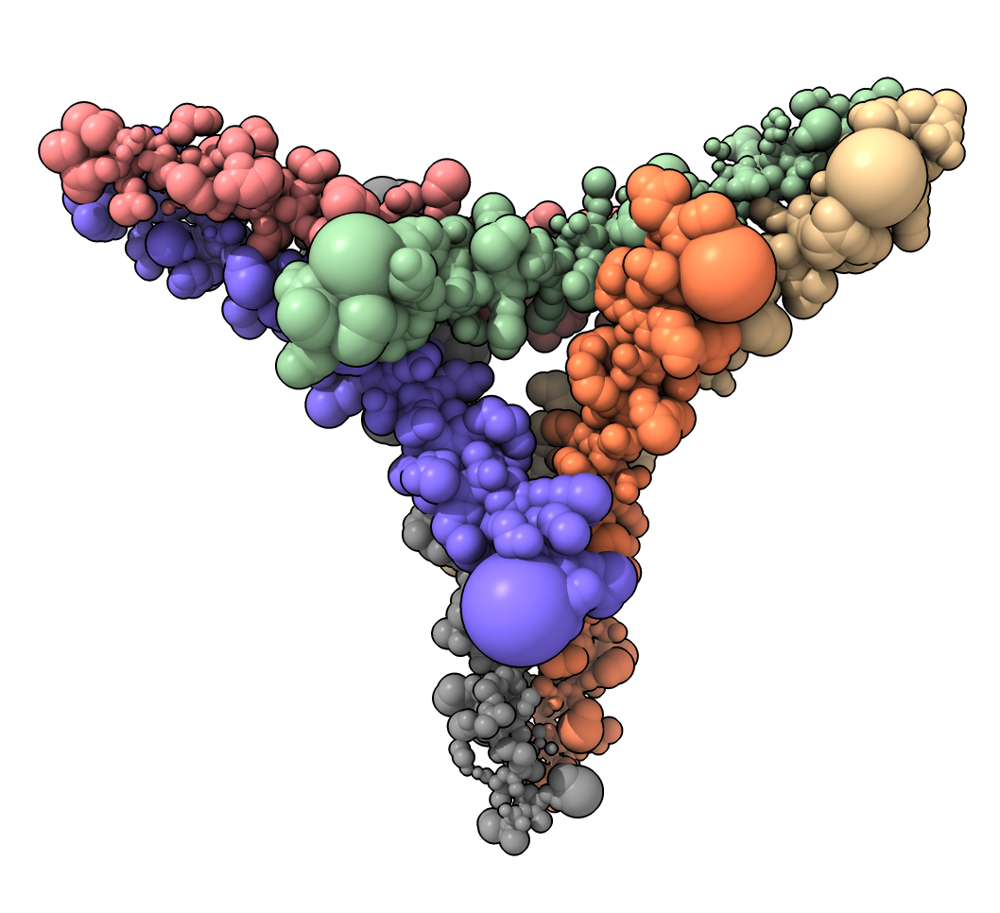

# Set atom radius using bfactor

Note that beginning with the ChimeraX 1.8 daily build, there is now an "size byattribute" command that provides the same kind of functionality as this recipe.  The commands to exactly duplicate the recipe example would be:

	open 7w91
	size byattr bfactor 20:.6 300:9

though simply:

	open 7w91
	size byattr bfactor

produces a very reasonable result.

Eric Pettersen, November 22, 2023

## Previous recipe for reference

Here is Python code defining a command "atomsize" that sets the radius of atom spheres to be proportional to an attributre such as bfactor.  Zhiyuan Liu [asked](https://mail.cgl.ucsf.edu/mailman/archives/list/chimerax-users@cgl.ucsf.edu/thread/SOU7SFWCXBL3J6DUSZ5YJMDORGKWCJON/) about this for showing gene expression on genome structure models in ChimeraX.  Here is an example that shows atom radii proportional to bfactor.

    open atomsize.py
    open 7w91
    atomsize #1 attribute bfactor scale 0.03

and here is the [atomsize.py](atomsize.py) code:

    def atomsize(session, atoms, attribute = 'bfactor', scale = 0.02, offset = 0.0):
        for a in atoms:
            value = getattr(a, attribute, None)
            if value is None:
                value = getattr(a.residue, attribute, None)  # Try residue attribute
            if value is not None:
                a.radius = offset + scale * value
                a.draw_mode = a.SPHERE_STYLE

    def register_command(logger):
        from chimerax.core.commands import register, CmdDesc, StringArg, FloatArg
        from chimerax.atomic import AtomsArg
        desc = CmdDesc(required = [('atoms', AtomsArg)],
                       keyword = [('attribute', StringArg),
                                  ('scale', FloatArg),
                                  ('offset', FloatArg),
                                  ],
                       synopsis='Set atom sizes proportional to an attribute value')
        register('atomsize', desc, atomsize, logger=logger)

    register_command(session.logger)

Tom Goddard, July 24, 2023

