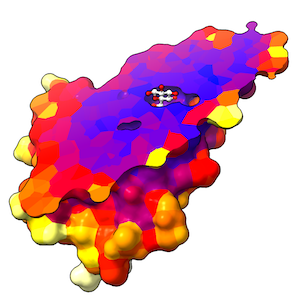

# Color a Sliced Surface by B-factor

Here is how to color a molecular surface by atomic B-factor,
including the planar cap where the surface is sliced by a clipping plane.

The following script clips everything, then turns off clipping
for the atoms so that they can protrude from the sliced surface.
The atoms of the protein are then colored by B-factor with
[color byattribute](http://rbvi.ucsf.edu/chimerax/docs/user/commands/color.html#byattribute).
This automatically colors their patches on the outer
surface of the protein, but not the sliced face of the surface.
The protein atoms themselves are also colored by B-factor 
even though they are not displayed,
and their coloring is then used by
[color zone](http://rbvi.ucsf.edu/chimerax/docs/user/commands/color.html#zone)
to color the surface cap model (the sliced face) by nearest atom.

    open 2gbp
    surface
    turn y 70
    clip front 0 position :bgc
    clip model #!1 false
    hide ~ligand target ar
    view ligand :<8 clip false
    style ligand ball
    color C white targ a
    graphics bgColor white
    graphics silhouette true
    color byattribute bfactor protein palette blue:red:yellow:white
    wait 1
    color zone #1.2.1 near protein distance 3 sharp t update t

The [wait 1](http://rbvi.ucsf.edu/chimerax/docs/user/commands/wait.html)
is needed only in the context of a command file,
to force drawing the graphics to create the surface cap before it is colored.

The 'update true' option of
[color zone](http://rbvi.ucsf.edu/chimerax/docs/user/commands/color.html#zone)
allows subsequently adjusting the clipping plane position
(''e.g.'', with the mouse) without having to redo the coloring.

Elaine Meng, September 9, 2020
