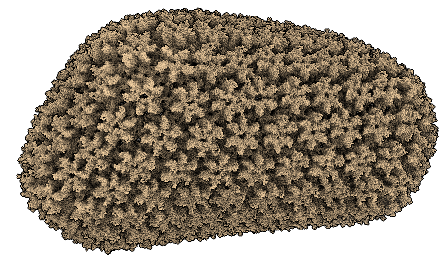

# Speed of BioPython vs ChimeraX

Chris Moth asked why ChimeraX does not use Biopython.  Biopython is a great package for doing non-interactive calculations on molecular structures.  But ChimeraX is all about interactive analysis and speed is very important to make it usable.

## How different are ChimeraX and Biopython in speed?

I timed opening a 2 million atom mmCIF file [3j3q](https://www.rcsb.org/structure/3J3Q) and getting its atom coordinates.  ChimeraX was 16 times faster reading the mmCIF, uses 3 times less memory, lists atoms 100 times faster, and gets coordinates 200 times faster.

|    software    | read mmCIF | memory used | atom list | coordinates |
|----------------|:----------:|:-----------:|:---------:|:-----------:|
| Biopython 1.78 |  131 sec   |   6.2 GB    |  0.4 sec  |   9.5 sec   |
| ChimeraX 1.1   |    8 sec   |   1.7 GB    | 0.004 sec |  0.04 sec   |

## Timing code

Here is the code I used to time ChimeraX opening the structure

     time open 3j3q

and accessing atoms and coordinates from Python shell (menu Tools / General / Shell)

    s = session.models[0]
    from time import time
    t0 = time() ; atoms = s.atoms ; t1 = time() ; print ('atoms', t1-t0)
    t0 = time() ; xyz = atoms.coords ; t1 = time() ; print ('coords', t1-t0)

And here is the code I used to time Biopython

    from Bio import PDB
    parser = PDB.MMCIFParser()
    from time imort time
    t0 = time() ; s = parser.get_structure('3j3q', '/Users/goddard/Downloads/ChimeraX/PDB/3j3q.cif') ; t1 = time() ; print('read mmcif', t1-t0)
    t0 = time() ; a = tuple(s.get_atoms()) ; t1 = time() ; print ('atoms', t1-t0)
    t0 = time() ; c = [a0.get_vector() for a0 in a] ; t1 = time() ; print ('coords', t1-t0)

Tom Goddard, September 15, 2020