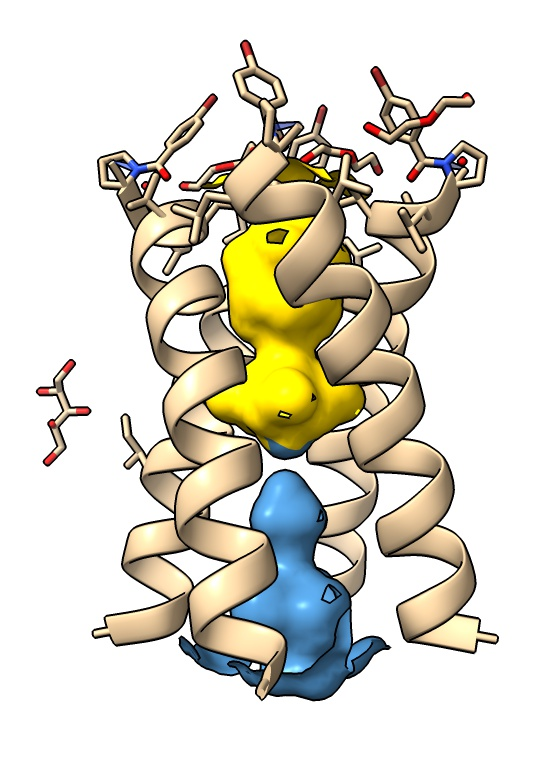
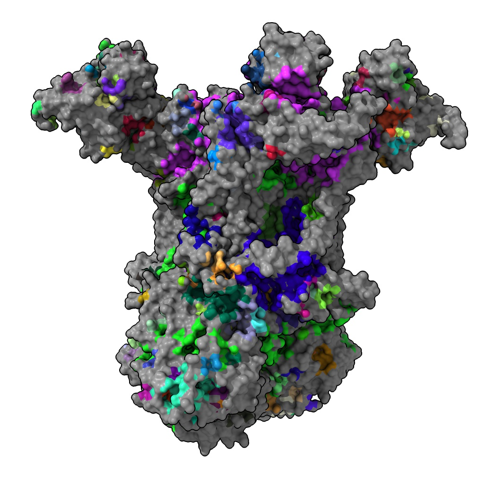

# Read CASTP pockets file

Our older program Chimera can read CASTP web server molecule pockets files (.poc) and
display surfaces for the pockets.  That has not yet been implemented in ChimeraX.
But the file format is easy to read.  Here we make a command that reads a CASTP pocket
file and define names in ChimeraX pocket1, pocket2, ... that specify the atoms lining
each pocket.  Opening the python code registers the readcastp command

    open read_castp.py

then use the command on an atomic model, here the influenza M2 ion channel,

    open 3lbw
    readcastp ~/Downloads/3lbw/3lbw.poc

and show and color two pockets

    surface pocket1 enclose protein visiblePatches 1
    color pocket1 gold surface
    surface pocket2 enclose protein visiblePatches 1 replace false
    color pocket2 steelblue surface

The .poc file is just a PDB file with the pocket number for each atom at the end

    ATOM    165  NH2 ARG A  45      -9.395 -35.779   0.675  1.00 32.68   2  POC
    ATOM    194  O   VAL B  27     -12.428  -9.493   5.152  1.00 13.76   1  POC
    ATOM    196  CG1 VAL B  27     -11.788  -7.554   2.677  1.00 14.96   1  POC
    ...

The script contructs the ChimeraX atom specifier from chain identifier, residue number and atom
name.  For example, the above lines are for atoms /A:45@NH2, /B:27@O, /B:27@CG1
in ChimeraX syntax belonging to pockets 2, 1 and 1. It then defines in the code
the name pocket1 using command "name pocket1 /B:27@O/B:27@CG1...".

Yaikhomba Mutum asked on the ChimeraX mailing list about looking at pockets of
the large complex III electron transfer structure PDB 3CX5.  Chimera is unable to
compute the surfaces for that large structure but ChimeraX has reliable surface calculation.
Here are the 509 pockets colored randomly using

    open 3cx5
    surface
    color gray surface
    readcastp ~/Downloads/3cx5/3cx5.poc color true

This takes a few minutes because the command parsing for the couple pockets with
thousands of atoms is slow.

Here is the [read_castp.py](read_castp.py) code:

    def pocket_atom_specifiers(poc_file_path):
        '''
        Parse .poc file from CASTP web server.  Lines are PDB format with pocket number at end:

        ATOM    165  NH2 ARG A  45      -9.395 -35.779   0.675  1.00 32.68   2  POC
        ATOM    194  O   VAL B  27     -12.428  -9.493   5.152  1.00 13.76   1  POC
        ATOM    196  CG1 VAL B  27     -11.788  -7.554   2.677  1.00 14.96   1  POC
        '''

        f = open(poc_file_path, 'r')
        lines = f.readlines()
        f.close()

        pockets = {}
        for line in lines:
            if line.startswith('ATOM  '):
                atom_name, chain_id, res_num = line[12:16].strip(), line[21:22], int(line[22:26])
                spec = '/%s:%d@%s' % (chain_id, res_num, atom_name)
                pocket_num = int(line[66:71])
                if pocket_num in pockets:
                    pockets[pocket_num].append(spec)
                else:
                    pockets[pocket_num] = [spec]

        pocket_specs = {pnum: ''.join(pspecs) for pnum, pspecs in pockets.items()}
        return pocket_specs

    def name_pockets(session, pocket_specs):
        '''
        Use ChimeraX name command to name the atoms for each pocket
        pocket1, pocket2, ....
        '''
        from chimerax.basic_actions.cmd import name
        for pnum, atoms_spec in pocket_specs.items():
            name(session, 'pocket%d' % pnum, atoms_spec)

    def color_pockets(session, n):
        '''
        Color n pockets randomly using named atoms pocket1, pocket2, ....
        '''
        from chimerax.core.colors import random_colors, hex_color
        from chimerax.core.commands import run
        for p, color in enumerate(random_colors(n)):
            run(session, 'color pocket%d %s' % (p+1, hex_color(color)))

    def readcastp(session, poc_file, color = False):
        pocket_specs = pocket_atom_specifiers(poc_file)
        name_pockets(session, pocket_specs)
        if color:
            color_pockets(session, len(pocket_specs))
        print('%d pockets' % len(pocket_specs))

    def register_command(logger):
        from chimerax.core.commands import CmdDesc, register, OpenFileNameArg, BoolArg 
        desc = CmdDesc(
            required = [('poc_file', OpenFileNameArg)],
            keyword = [('color', BoolArg)],
            synopsis = 'Read CASTP pockets file'
        )
        register('readcastp', desc, readcastp, logger=logger)

    register_command(session.logger)

Tom Goddard, January 18, 2021
