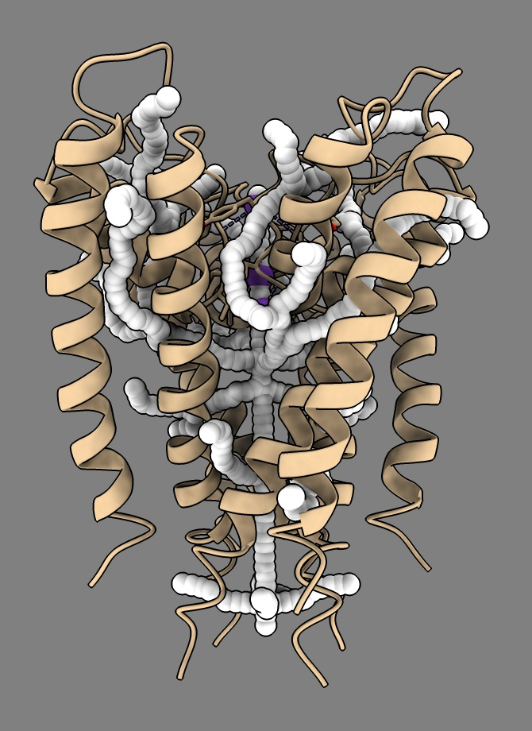
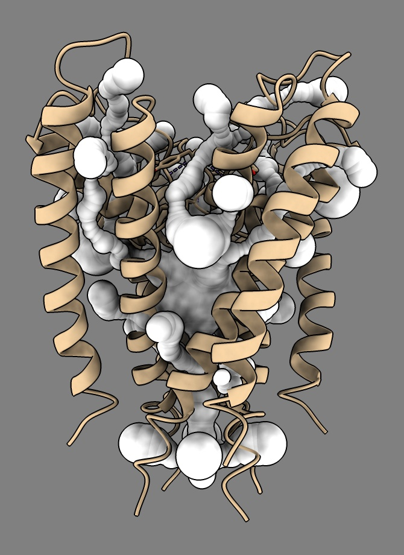
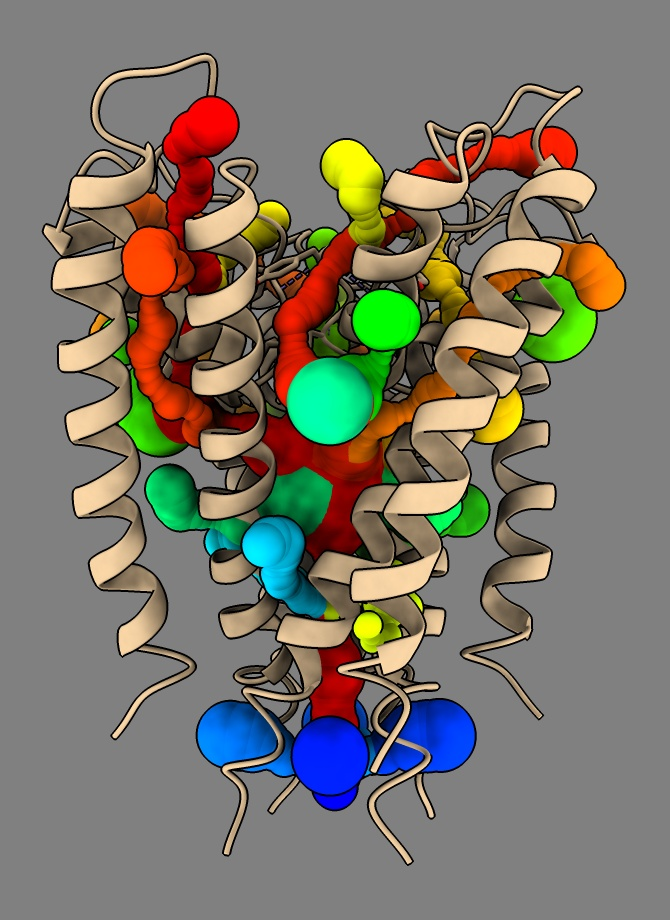
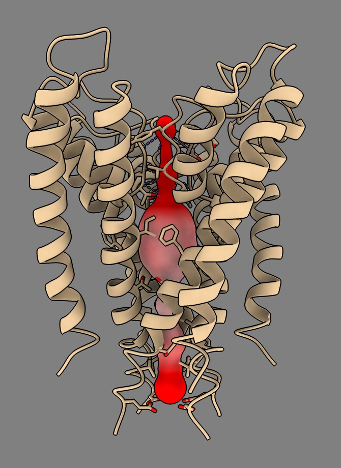

# Show CAVER tunnels

Here is how to show [CAVER](https://caver.cz) tunnels in biomolecular structures in ChimeraX.  We'll look at example data [caver_1bl8.zip](caver_1bl8.zip)that comes with CAVER 3.0 for potassium channel PDB [1bl8](https://www.rcsb.org/structure/1bl8).

CAVER produces a PDB file for each tunnel in the directory

    results/data/clusters_timeless

with names

    tun_cl_001_1.pdb
    tun_cl_002_1.pdb
    ...
    tun_cl_034_1.pdb
    tun_cl_035_1.pdb

We can open all those in ChimeraX, then change the atoms to sphere style.

    open 1bl8
    open ~/Downloads/caver_1bl8/results/data/clusters_timeless/tun*.pdb
    style #2-36 sphere

The tunnel radius for each atom is given as the bfactor.  ChimeraX does not have a command to set the radius to the b-factor value right now, but we can do it with some Python.  First select all the tunnels

    select #2-36

Then open this Python file [set_radius_to_bfactor.py](set_radius_to_bfactor.py) to set the radii of all the selected atoms to the b-factor

     open ~/Downloads/set_radius_to_bfactor.py
     
Alternatively you can type the following Python code into the ChimeraX Python shell, menu Tools / General / Shell

    from chimerax.atomic import selected_atoms
    for a in selected_atoms(session):
      a.radius = a.bfactor

You can color each tunnel differently with

    rainbow #2-36 structures

You can flip through them showing each individually with

    mseries slider #2-36

The tunnels also look nicer as surfaces instead of atoms

    surface #2-36
    hide #2-36 atoms

If you hover your mouse over the central channel tunnel you see it is model #23.  I can show just that one and color it by electrostatic potential of the protein as in Elaine's MOLE tutorial (https://www.rbvi.ucsf.edu/chimerax/data/mole-channel/mole-channel.html#radius)

    hide #!2-36 models
    show #23 model

    coulombic protein surfaces #23 offset -1

Also to see the side-chains that come close to the central tunnel I can use the clashes command

    clashes #23 restrict #1 overlapCutoff -1 reveal true

That reshows the tunnel atoms so hide them again

    hide #23 atoms

Elaine's [ChimeraX MOLE tutorial](https://www.rbvi.ucsf.edu/chimerax/data/mole-channel/mole-channel.html) also shows electrostatic surfaces on the protein, and she gave a [journal-club review of tunnel programs](https://www.cgl.ucsf.edu/home/meng/jclub/tunnels.html).

Tom Goddard, October 3, 2023