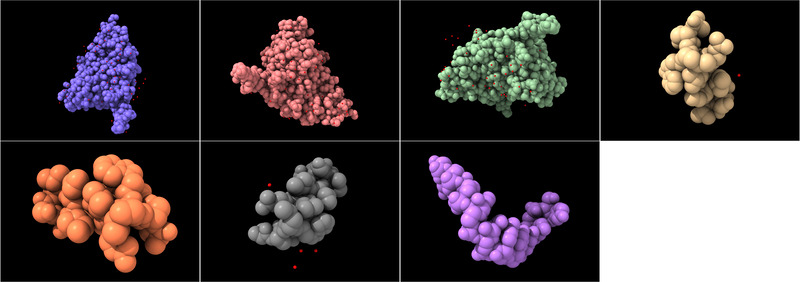

# Save an Image of each Chain

Here is Python code that defines a command that saves an image of each chain of an atomic structure

    open chain_images.py

then use the command on the atomic model.

    chainimages #1

Here is the [chain_images.py](chain_images.py) code:

    # Create command to save an image of each chain of an atomic structure.
    #
    #  chainimages #1
    #
    def chain_images(session, structures):
        from chimerax.core.commands import run
        for structure in structures:
            for chain_id in structure.residues.unique_chain_ids:
                run(session, 'show #%s/%s only' % (structure.id_string, chain_id))
                run(session, 'view')
                run(session, 'save ~/Desktop/%s_chain_%s.png' % (structure.name, chain_id))

    def register_command(session):
        from chimerax.core.commands import CmdDesc, register
        from chimerax.atomic import StructuresArg
        desc = CmdDesc(required=[('structures', StructuresArg)],
                       synopsis='Save image of each chain')
        register('chainimages', desc, chain_images, logger=session.logger)

    register_command(session)

# Save an Image of specified Chains

The previous code saves an image for every chain.  What if we want to specify the chains

    chainimages #1/A,B,C

Here is a variation on the code [chain_images2.py](chain_images2.py) that does that.

    # Create command to save an image of specified chains of an atomic structure.
    #
    #  chainimages #1/A,B,C
    #
    def chain_images(session, atoms):
        from chimerax.core.commands import run
        for structure, chain_id, chain_atoms in atoms.by_chain:
            run(session, 'show #%s/%s only' % (structure.id_string, chain_id))
            run(session, 'view')
            run(session, 'save ~/Desktop/%s_chain_%s.png' % (structure.name, chain_id))

    def register_command(session):
        from chimerax.core.commands import CmdDesc, register
        from chimerax.atomic import AtomsArg
        desc = CmdDesc(required=[('atoms', AtomsArg)],
                       synopsis='Save image of each chain')
        register('chainimages', desc, chain_images, logger=session.logger)

    register_command(session)

Tom Goddard, December 11, 2020
