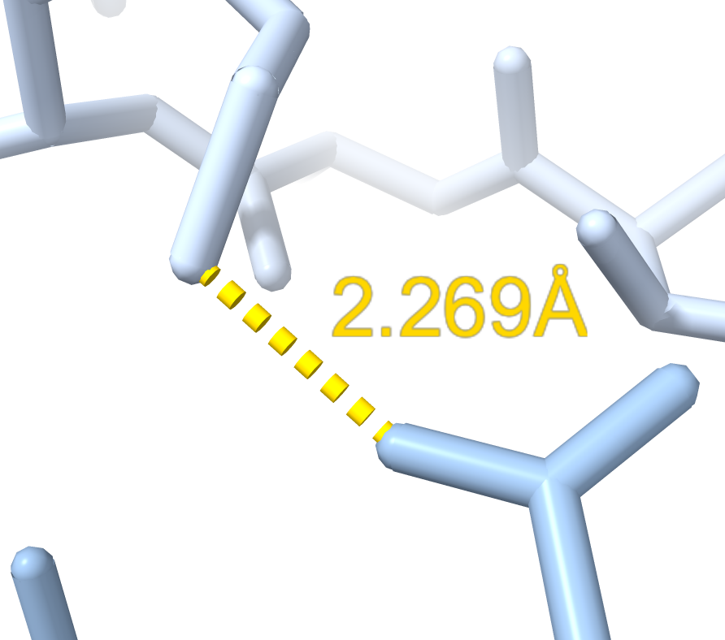
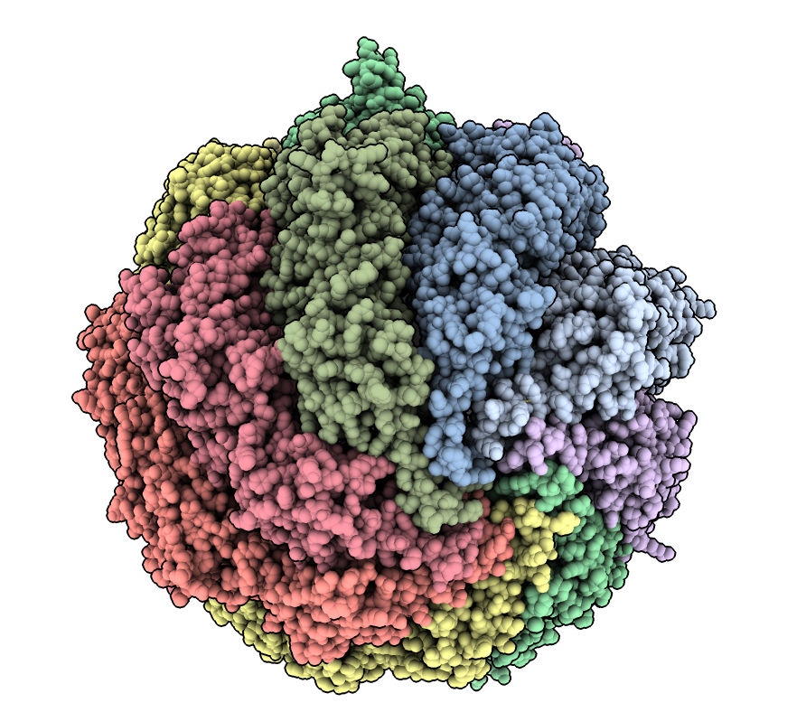

# Find closest pair of atoms

Here is Python code defining a command "closest" that finds the closest pair of atoms between two set of atoms.  Opening the closest.py code in ChimeraX adds the command

    open closest.py

then use the command on two sets of atoms

    open 7LUP
    closest /A to /B show true

    Minimum distance 2.27 between /A LYS 45 NZ and /B ASP 522 OD1
    

Here is the [closest.py](closest.py) code:

    #
    # Add command "closest" that finds the closest pair of atoms given two
    # sets of atoms.
    #
    # open 7LUP
    # closest /A to /B
    #
    #  Minimum distance 2.27 between /A LYS 45 NZ and /B ASP 522 OD1
    #

    def closest(session, atoms, to_atoms, max_dist = 10, show = False):
        xyz1, xyz2 = atoms.scene_coords, to_atoms.scene_coords
        from chimerax.geometry import find_closest_points
        i1, i2, nearest1 = find_closest_points(xyz1, xyz2, max_dist)
        v = xyz2[nearest1] - xyz1[i1]
        d2 = (v*v).sum(axis=1)
        c = d2.argmin()
        c1, c2 = i1[c], nearest1[c]
        a1, a2 = atoms[c1], to_atoms[c2]
        from math import sqrt
        d = sqrt(d2[c])
        report_closest(session, d, a1, a2, show)
        return d, a1, a2

    def report_closest(session, d, a1, a2, show):
        session.logger.status('Minimum distance %.2f between %s and %s'
                              % (d, str(a1), str(a2)), log = True)
        if show:
            from chimerax.core.commands import run
            run(session, 'distance %s %s' % (a1.atomspec, a2.atomspec))
            run(session, 'view %s %s' % (a1.atomspec, a2.atomspec))

    def closest_slow(session, atoms, to_atoms, max_dist = 10, show = False):
        '''Loop through every pair of atoms in Python.  This is slow.'''
        dmin = amin1 = amin2 = None
        from chimerax.geometry import distance
        for a1 in atoms:
            for a2 in to_atoms:
                d = distance(a1.scene_coord, a2.scene_coord)
                if (dmin is None or d < dmin) and d <= max_dist:
                    dmin, amin1, amin2 = d, a1, a2
        report_closest(session, dmin, amin1, amin2, show)
        return dmin, amin1, amin2

    def register_command(session):
        from chimerax.core.commands import CmdDesc, register, FloatArg, BoolArg
        from chimerax.atomic import AtomsArg
        desc = CmdDesc(required= [('atoms', AtomsArg)],
                       keyword = [('to_atoms', AtomsArg),
                                  ('max_dist', FloatArg),
                                  ('show', BoolArg)],
                       required_arguments = ['to_atoms'],
                       synopsis = 'find closest pair of atoms')
        register('closest', desc, closest, logger=session.logger)

    register_command(session)

Tom Goddard, Sptember 28, 2021
