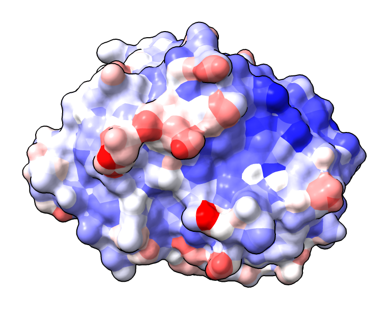
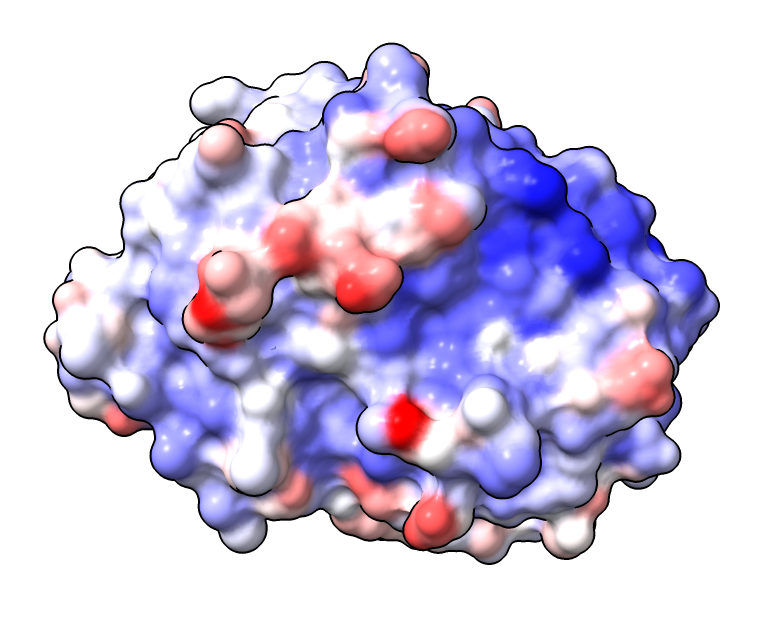

# Smooth surface coloring

Here is a Python script to smooth the sharp edges between colors on a molecular surface.  Pedro Bule [asked](https://mail.cgl.ucsf.edu/mailman/archives/list/chimerax-users@cgl.ucsf.edu/thread/WONOLW7JZC6RSHAPPQGMXWIKNG7KV6UA/) about how to show blurred edges on a surface colored by residue conservation.  By default ChimeraX makes sharp edges between each residue surface patch.  We start with that coloring and then diffuse the colors to nearby surface points.  The Python code below defines the "color smooth" command when the [color_smooth.py](color_smooth.py) file is opened in ChimeraX

    open color_smooth.py

Here is a demonstration smoothing bfactor coloring.  Any surface coloring can be smoothed.

    open 8vgz
    surface
    color bfactor #1
    color smooth #1

To get a smoother boundaries we can make the surface triangles smaller

    surface gridspacing 0.3
    color bfactor #1
    color smooth #1
   

Left sharp edge bfactor coloring.  Middle smoothed coloring.  Right smoother using smaller surface triangles.

Here is the [color_smooth.py](color_smooth.py) code:

    # Smooth colors on a surface by averaging neighbor colors.
    # Pedro Bule wanted coloring by residue conservation to have soft edges like in Chimera.
    # But the molecular surface mesh is not regular like in Chimera, so smoothing is needed.
    # This code is quite slow taking 84 seconds for a surface with grid spacing 0.2 for
    # 286 residues.

    def smooth_surface_colors(surface, distance = 0.5, iterations = 10):
        triangles = surface.triangles
        if hasattr(surface, '_joined_triangles'):
            # Sharp edge surfaces have disconnected triangles, but we need connected triangles.
            triangles = surface._joined_triangles

        vertices = surface.vertices

        # Count the number of neighboring vertices for each vertex.
        from numpy import float32, zeros, int32, uint8, maximum
        nv = vertices.shape[0]
        neighbor_counts = zeros((nv,), int32)
        for v in triangles.flat:
            neighbor_counts[v] += 2
        neighbor_counts = neighbor_counts.reshape((nv,1))
        maximum(neighbor_counts, 1, neighbor_counts)  # Avoid divide by zero below.

        # Average the colors from neighboring vertices
        vc0 = surface.vertex_colors.astype(float32)
        delta_vc = vc0.copy()
        from chimerax.geometry import distance as edge_length
        from math import exp
        for i in range(iterations):
            delta_vc[:] = 0
            for v1,v2,v3 in triangles:
                for ev1,ev2 in ((v1,v2),(v2,v1),(v1,v3),(v3,v1),(v2,v3),(v3,v2)):
                    d = edge_length(vertices[ev1], vertices[ev2])
                    delta_vc[ev2] += exp(-d/distance)*(vc0[ev1]-vc0[ev2])
            delta_vc /= neighbor_counts
            vc0[:] += delta_vc

        vc = vc0.astype(uint8)
        return vc

    def color_smooth(session, surfaces, distance = 0.5, iterations = 10):
        for surf in surfaces:
            if surf.vertex_colors is None:
                from chimerax.core.errors import UserError
                raise UserError(f'Surface {surf} does not have vertex colors')
            vc = smooth_surface_colors(surf, distance, iterations)
            if hasattr(surf, '_joined_triangles'):
                # Eliminate sharp edges since we did not compute colors for
                # duplicate vertices.
                surf.set_geometry(surf.vertices, surf.normals, surf._joined_triangles)
            surf.vertex_colors = vc

    def register_command(logger):
        from chimerax.core.commands import register, CmdDesc, SurfacesArg, FloatArg, IntArg
        from chimerax.atomic import AtomsArg
        desc = CmdDesc(required = [('surfaces', SurfacesArg)],
                       keyword = [('distance', FloatArg),
                                  ('iterations', IntArg)],
                       synopsis='Smooth colors on surfaces')
        register('color smooth', desc, color_smooth, logger=logger)

    register_command(session.logger)

Tom Goddard, February 16, 2024
