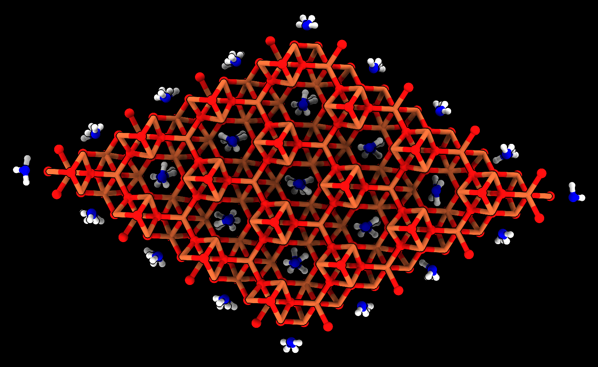

# Connect nearby atoms

Here is Python code defining a command "connect" that adds bonds between nearby atoms within a specified distance.  I was trying to make a hydrated iron-oxide crystal [ferrihydrite](https://www.science.org/doi/10.1126/science.1142525) from the asymmetric unit and used this connect to command to make appropriate bonds. Open the Python code to define the command

    open connect.py

then use the command to bond atoms in the crystal made from asymmetric unit [ferrihydrite6_asym_unit.cif](ferrihydrite6_asym_unit.cif).

    open ferrihydrite6_asym_unit.cif
    unitcell #1 cells 4,4,2
    combine #2 name ferrihydrite6_crystal

The crystal has lots of overlapped atoms so we delete those using some other custom code defining the [overlap](../overlap/overlap.md) command

    overlap #3
    delete sel

Then add bonds

    connect #3

The authors of this crystal structure say the hydrogen positions are uncertain.  We add them to the O1 atom to make it a water.  To make the water from O1 disconnect it from the irons, set the hybridization state to O3, and add hydrogens

    ~bond #3@O1 | Fe
    setattr #3@O1 atoms idatm_type O3
    addh #3

We color the water oxygens blue and save the result [ferrihydrite6_crystal.mol2](ferrihydrite6_crystal.mol2)

    color #3@O1 blue
    save ferrihydrite6_crystal.mol2 model #3
    

Here is the [connect.py](connect.py) code:

    #
    # Add bonds between close atoms.  For example,
    #
    #     connect #1
    #
    def connect_atoms(session, atoms, to_atoms = None, distance = 2.2):
        if to_atoms is None:
            to_atoms = atoms
        xyz = to_atoms.scene_coords
        bonds = []
        from chimerax.geometry import find_close_points
        for a in atoms:
            i1, i2 = find_close_points([a.scene_coord], xyz, distance)
            for a2 in to_atoms[i2]:
                if a2 is not a and not a2.connects_to(a):
                    b = a.structure.new_bond(a, a2)
                    bonds.append(b)
        session.logger.status(f'Made {len(bonds)} bonds between'
                              f' {len(atoms)} and {len(to_atoms)} atoms',
                              log = True)
        return bonds

    def register_command(logger):
        from chimerax.core.commands import register, CmdDesc, FloatArg
        from chimerax.atomic import AtomsArg
        desc = CmdDesc(required = [('atoms', AtomsArg)],
                       keyword = [('to_atoms', AtomsArg),
                                  ('distance', FloatArg)],
                       synopsis='Connect close atoms')
        register('connect', desc, connect_atoms, logger=logger)

    register_command(session.logger)

Tom Goddard, March 16, 2022
