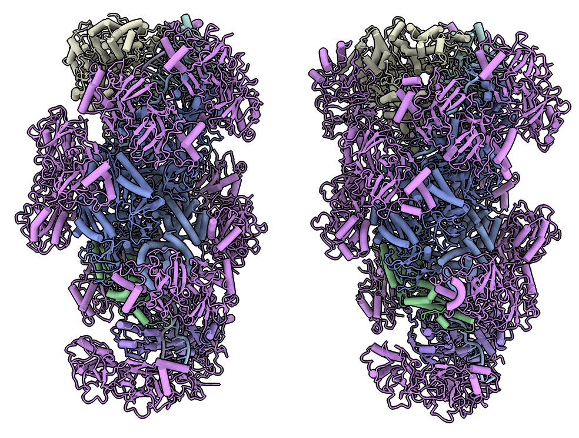

# Copy chain colors

Here is Python code defining a command "copycolors" that copies ribbon colors from one set of chains to another set of chains with matching chain ids.  Only the target ribbons are colored, not the atoms.  Jacob Andersen [https://plato.cgl.ucsf.edu/pipermail/chimerax-users/2022-January/003089.html](asked) how to do this.  Open the Python code to define the command

    open copycolors.py

then use the command on two structures

    open 6s8e 6s6b
    copycolors #1 to #2
    preset cylinder
    tile #1,2 column 2 spacing 1

Here is the [copycolors.py](copycolors.py) code:

    #
    # Add command "copycolors" that copies ribbon colors from one set of chains to another
    # by matching chain ids.
    #
    # copycolors #1 to #2
    #
    def copy_chain_colors(session, from_atoms, to_atoms = None):

        from_res = from_atoms.residues
        # Don't use non-polymer residue colors
        from chimerax.atomic import Residue
        from_res = from_res[from_res.polymer_types != Residue.PT_NONE]
        chain_colors = {cid:color for cid,color in zip(from_res.chain_ids, from_res.ribbon_colors)}

        for s, s_to_atoms in to_atoms.by_structure:
            for cid in set(s_to_atoms.chain_ids):
                if cid in chain_colors:
                    from chimerax.core.commands import run
                    from chimerax.core.colors import hex_color
                    run(session, 'color #%s/%s %s ribbon'
                        % (s.id_string, cid, hex_color(chain_colors[cid])))

    def register_command(session):
        from chimerax.core.commands import CmdDesc, register, FloatArg, BoolArg
        from chimerax.atomic import AtomsArg
        desc = CmdDesc(required= [('from_atoms', AtomsArg)],
                       keyword = [('to_atoms', AtomsArg)],
                       required_arguments = ['to_atoms'],
                       synopsis = 'copy ribbon colors for chains')
        register('copycolors', desc, copy_chain_colors, logger=session.logger)

    register_command(session)

Tom Goddard, January 14, 2022
