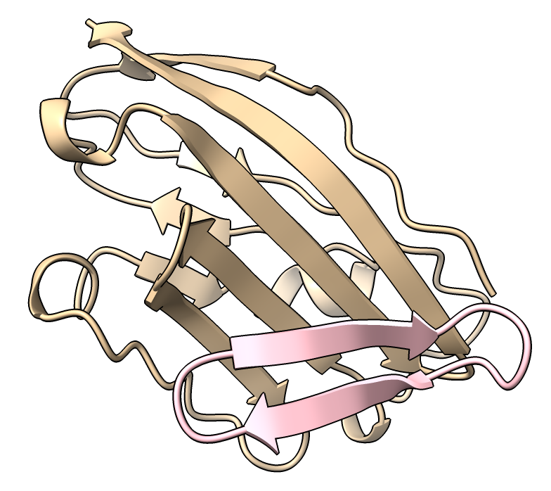

# Show a cyclic peptide ribbon

Chimerax does not close the ends of a ribbon of a cyclic peptide.  Here is a trick to make an image that shows the ribbon forming a smooth loop with no breaks.  This was requested by Stephen Rettie in a ChimeraX [ticket](https://www.rbvi.ucsf.edu/trac/ChimeraX/ticket/15360).  The idea is to extend the cyclic peptide to twice its length by going around the cycle twice, then just show the middle part as a ribbon.  The extra hidden end residues make the ribbon appear to traverse a smooth loop.

In the example file [cyclic_peptide.pdb](cyclic_peptide.pdb) the closing peptide bond is not present.  If your file has that closing bond you should delete it (selected it then command "~bond sel").  Here are commands [cyclic_ribbon.cxc](cyclic_ribbon.cxc) to extend chain A and show its ribbon.  The [renumber](https://www.cgl.ucsf.edu/chimerax/docs/user/commands/renumber.html) and [combine](https://www.cgl.ucsf.edu/chimerax/docs/user/commands/combine.html) commands are used.

    # Chain A is cyclic and chain B is not cyclic in this structure
    open cyclic_peptide.pdb

    # Make a second copy to extend chain A.  The combine command with one model makes a copy.
    combine #1

    # Delete chain B of the copy since only chain A is cyclic
    del #2/B

    # Renumber the residues of the copy so they can be appended to the original model.
    # The cyclic peptide chain A is residues 1-16, so make these extra ones 17-32.
    renumber #2 start 17

    # Now combine the original atomic structure and these extra residues
    # The retainIds option means to keep both chain A as a single chain A instead of renaming one.
    # The close option means close the original two models leaving only the combined one as #1.
    combine #1,2 retainIds true close true

    # Now hide 8 residues on each end of the cyclic peptide.
    # We added these just to get the ribbon to smoothly join itself.
    hide #1/A:1-8,25-32 ribbon

    # The chain A ribbon inherited the colors from the original two models, so recolor it.
    color #1/A pink

Tom Goddard, June 5, 2024