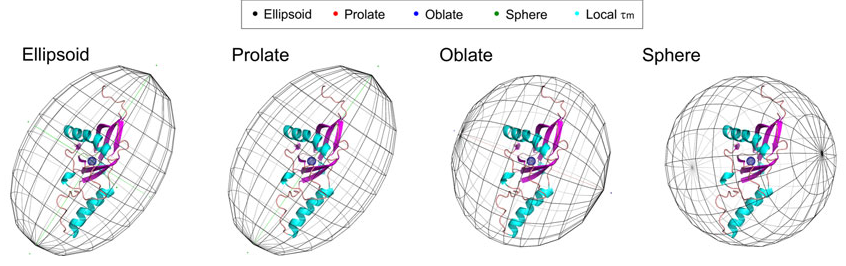

# Show a rotational diffusion tensor ellipsoid

Arun Gupta [asked](https://plato.cgl.ucsf.edu/pipermail/chimerax-users/2021-March/002033.html) on the ChimeraX mailing list about how to display a rotational
diffusion tensor computed by [ROTDIF software](http://gandalf.umd.edu/FushmanLab/pdsw.html)
as a mesh ellipsoid.  ROTDIF produces a PyMol Python script (for example
[ELM_ellipsoid.py](ELM_ellipsoid.py)) to show the ellipsoid.  Here we make a similar
script for ChimeraX.

At first it seemed the ChimeraX command [shape ellipsoid](https://www.cgl.ucsf.edu/chimerax/docs/user/commands/shape.html#ellipsoid)
would do the job.  But the mesh pattern for the ellipsoid is not latitude and longitude
lines, instead it uses a spiral triangulation for best ellipsoid surface smoothness.
So the code below instead makes the latitude and longitude lines.

Here is an image Arun provided illustrating what is desired

And here is an example of the ellipsoid produced by the ChimeraX script

The ChimeraX script has at the top the 4 lines of parameters produced by ROTDIF.
Opening the script [ELM_ellipsoid_chimerax.py](ELM_ellipsoid_chimerax.py) in ChimeraX
produces the ellipsoid model.

    # Make an ellipsoid depiction in ChimeraX using parameters from
    # ROTDIF software http://gandalf.umd.edu/FushmanLab/pdsw.html

    # Parameters on the following 4 lines come from end of
    # PyMol script produced by ROTDIF.

    #1. Center of Mass of the molecule
    cmx, cmy, cmz = 20.051, 6.333, -0.915
    #2. Ellipsoid semiaxes length (in Angstrom)
    a1,a2,a3 = 21.700, 24.645, 16.567
    #3. Color: see https://pymolwiki.org/index.php/Color_Values for more options
    color = [0.85, 0.85, 1.00]
    #4. Rotation Input: three Euler angles: alpha, beta, gamma (in degrees)
    rotationInput = [83.790, 114.370, 179.850]

    # Make an ellipsoid showing lattitute and longitude lines.
    # ChimeraX shape sphere command uses smooth spiral triangulation so cannot be used.
    def ellipsoid_mesh(session, name, center, radii, rotation, divisions, color, opacity):
        vertices, edges = lattitude_longtitude_circles(divisions)

        # Stretch, rotate and center
        vertices *= radii
        rotation.transform_points(vertices, in_place = True)
        vertices += center

        # Create ellipsoid model
        from chimerax.core.models import Surface
        s = Surface(name, session)
        normals = None
        s.set_geometry(vertices, normals, edges)
        s.color = [int(255*r) for r in color+[opacity]]
        s.display_style = s.Mesh
        session.models.add([s])

    def lattitude_longtitude_circles(n = 10):
        cvertices,cedges = unit_circle()

        vertices = []
        edges = []

        # Make lattitude circles
        from math import pi, sin, cos
        for i in range(n):
            a = pi * (i+1) / (n+1)
            v,e = cvertices.copy(), cedges.copy()
            v *= sin(a)
            v[:,2] += cos(a)
            e += len(vertices)*len(v)
            vertices.append(v)
            edges.append(e)

        # Make longitude circles
        from chimerax.geometry import vector_rotation
        for i in range(n):
            a = pi * i / n
            v,e = cvertices.copy(), cedges.copy()
            normal = (cos(a), sin(a), 0)
            vector_rotation((0,0,1), normal).transform_points(v, in_place = True)
            e += len(vertices)*len(v)
            vertices.append(v)
            edges.append(e)

        from numpy import concatenate
        return concatenate(vertices), concatenate(edges)

    def unit_circle(n = 200):
        from numpy import empty, float32, int32, sin, cos, arange, pi
        a = arange(0, 2*pi, 2*pi/n)
        vertices = empty((n,3), float32)
        vertices[:,0] = cos(a)
        vertices[:,1] = sin(a)
        vertices[:,2] = 0
        edges = empty((n,2), int32)
        edges[:,0] = range(n)
        edges[:,1] = (edges[:,0] + 1) % n
        return vertices, edges

    def euler_rotation(euler_angles):
        from math import radians, cos, sin
        a, b, g = [radians(a) for a in euler_angles]
        R11, R12, R13 = cos(g) * cos(b) * cos(a) - sin(g) * sin(a), -sin(g) * cos(b) * cos(a) - cos(g) * sin(a), sin(b) * cos(a)
        R21, R22, R23 = cos(g) * cos(b) * sin(a) + sin(g) * cos(a), -sin(g) * cos(b) * sin(a) + cos(g) * cos(a), sin(b) * sin(a)
        R31, R32, R33 = -cos(g) * sin(b), sin(g) * sin(b), cos(b)
        from chimerax.geometry import Place
        rot = Place(axes = ((R11, R21, R31), (R12, R22, R32), (R13, R23, R33)))
        return rot

    # Show ellipsoid in ChimeraX
    ellipsoid_mesh(session,
                   name = 'diffusion ellipsoid',
                   center = (cmx,cmy,cmz),
                   radii = (a1,a2,a3),
                   rotation = euler_rotation(rotationInput),
                   divisions = 10,
                   color = color,
                   opacity = 1.0)

Tom Goddard, March 16, 2021
