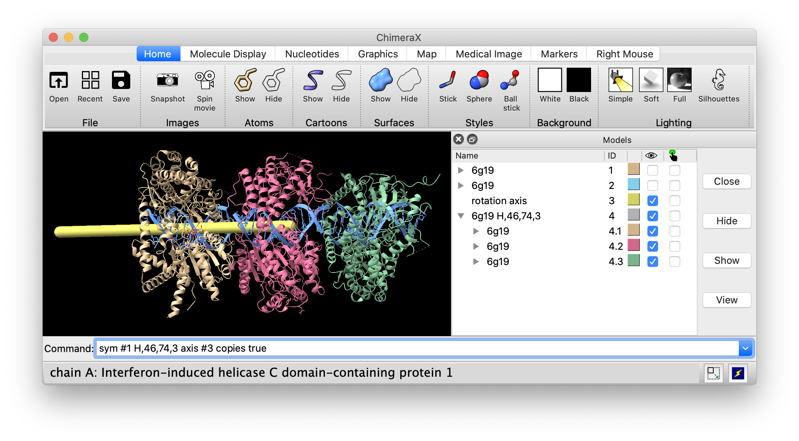

# Make a helical filament atomic model

To make a helical filament three subunits long from a single subunit PDB [6g19](https://www.rcsb.org/structure/6G19) with rise of 46 Angstroms per turn and 76 degrees rotation per subunit I'll use the ChimeraX [sym](https://www.cgl.ucsf.edu/chimerax/docs/user/commands/sym.html) command.

I want the axis of the filament aligned to the axis of the double stranded RNA, chains X and Y.  To calculate this axis I open 2 copies of the structure, [align](https://www.cgl.ucsf.edu/chimerax/docs/user/commands/align.html) the second copy RNA to the first copy RNA shifted by one nucleotide, then use the [measure rotation](https://www.cgl.ucsf.edu/chimerax/docs/user/commands/measure.html#rotation) command to get axis of the rotation that moves the first copy to the second copy.

    open 6g19
    open 6g19
    align #2/X:1-13@P #2/Y:2-14@P to #1/X:2-14@P #1/Y:1-13@P 
    measure rotation #1 to #2
    sym #1 H,46,74,3 axis #3 copies true

Here is what this looks like:

I colored the RNA blue with command

    color #4/X,Y cornflowerblue
    
I changed the subunit colors using the color buttons in the Models panel.

Tom Goddard, September 10, 2020