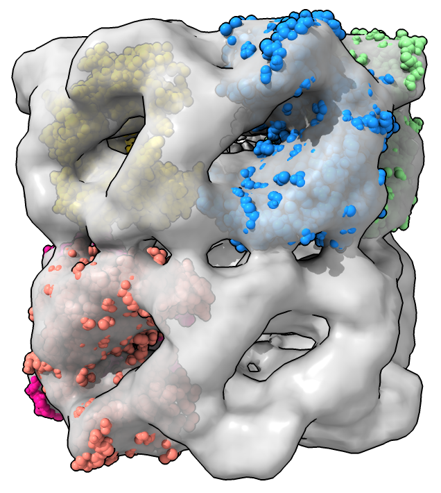

# Fit structure in map in many places and save results

We add a command that use the fitmap command with the search option to randomly place an atomic structure in an map and optimize the position.  Then we save the resulting positions where correlation is greater than some value each in a separate PDB file.  Opening the Python code defines the new fitsearch command

    open fit_search.py

Then open an atomic structure from the PDB and an map from the EMDB and compute and save fits.  I only want to fit chain A so I delete all other chains.  The resolution option is to simulate a map from the atomic structure used in fitting.  Only fits with correlation at least 0.9 are saved.

    open 1grl
    delete ~/A
    open 1080 from emdb
    fitsearch #1 in #2 resolution 11.5 search 50 cutoff 0.9 save ~/Desktop/results/fit_%d.pdb
    

Here is the [fit_search.py](fit_search.py) code.  It requires a ChimeraX version newer than July 27, 2021.

    # Create command fitsearch to run fitmap with the search option,
    # then save the results that have correlation higher than a specified value.
    #
    #  fitsearch #1 in #2 resolution 11.5 search 50 cutoff 0.9 save ~/Desktop/results/mol.pdb

    def fit_search(session, atoms, in_map, resolution = None, search = 10, cutoff = 0.5,
                   save = None):
        if resolution is None:
            resolution = 3*min(in_map.grid.step)

        from chimerax.map_fit.fitcmd import fitmap
        fits = fitmap(session, atoms, in_map, resolution = resolution, search = search)
        good_fits = [f for f in fits if f.correlation() >= cutoff]
        from chimerax.map_fit.search import save_fits
        save_fits(session, good_fits, save)

    def register_command(session):
        from chimerax.core.commands import CmdDesc, register, ObjectsArg, FloatArg, IntArg, SaveFileNameArg
        from chimerax.map import MapArg
        desc = CmdDesc(required=[('atoms', ObjectsArg)],
                       keyword=[('in_map', MapArg),
                                ('resolution', FloatArg),
                                ('search', IntArg),
                                ('cutoff', FloatArg),
                                ('save', SaveFileNameArg)],
                       required_arguments = ['in_map'],
                       synopsis='Save atomic structures fit in a map')
        register('fitsearch', desc, fit_search, logger=session.logger)

    register_command(session)

Tom Goddard, July 26, 2021
