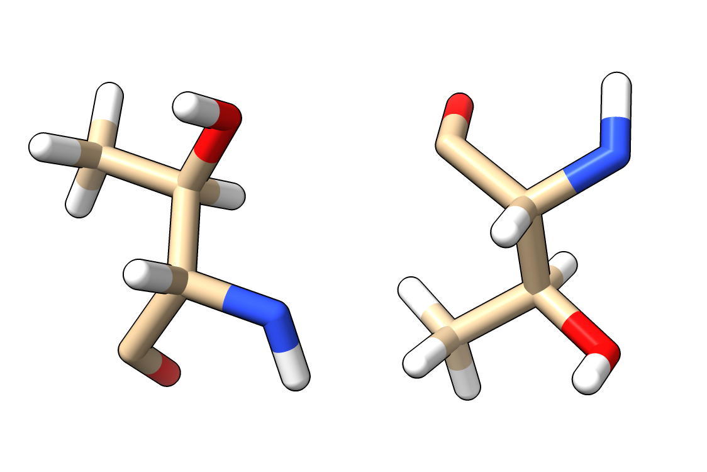

# Flip Atom Z Coordinates

Here is Python code defining a command flip that changes atom z coordinates z -> -z.   This changes the hand of the atomic structure, for instance changing all L amino acids to D amino acids.  Open flip.py in ChimeraX 1.0 to define the flip command

    open flip.py

then use the command on the atomic model.

    flip #1

Here is the [flip.py](flip.py) code:

    # Create command to change atom coordiates z -> -z.
    # Opening this file in ChimeraX 1.0 defines the flip command.
    #
    #  flip #1

    def flip(session, atoms):
        xyz = atoms.coords
        xyz[:,2] *= -1
        atoms.coords = xyz

    def register_command(session):
        from chimerax.core.commands import CmdDesc, register
        from chimerax.atomic import AtomsArg
        desc = CmdDesc(required=[('atoms', AtomsArg)],
                       synopsis='flip atom z coordinates')
        register('flip', desc, flip, logger=session.logger)

    register_command(session)

Tom Goddard, September 3, 2020
