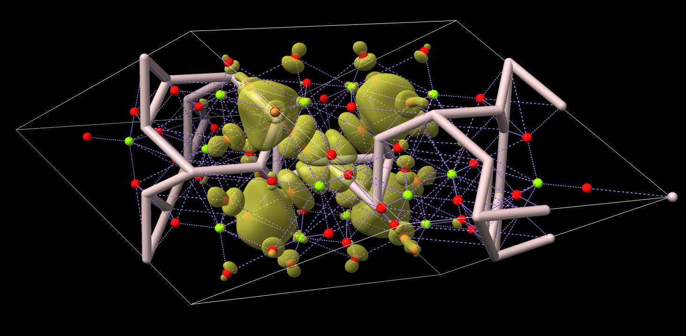

# Make atoms for Gaussian cube file

ChimeraX can display wave-function volume data from Gaussian cube format files but it
ignores the atoms listed in the file.  Zack Gainsforth asked about how to show the atoms.
This script makes the atoms.  First you open the Gaussian cube file and then this script.

    open wfc_K001_B329wfc.cube
    open make_atoms.py

ChimeraX is not designed to handle inorganic crystals so the bonds it creates
maybe be wrong.  In this example image pink is aluminum, red is oxygen, green is
magnesium, purple lines are predicted metal coordination.

Here is the [make_atoms.py](make_atoms.py) code:

    #
    # ChimeraX script to create atoms from Gaussian cube files (quantum mechanics calculations).
    # The Gaussian cube file reader in ChimeraX only display the map, not the atoms.
    # To use, first open the Gaussian cube file then open this script.  For example
    #
    #   open wfc_K001_B329wfc.cube
    #   open make_atoms.py
    #
    def make_gaussian_cube_atoms(session):
	from chimerax.map import Volume
	from chimerax.map_data.gaussian.gaussian_grid import GaussianGrid
	glist = [m.data for m in session.models
		 if isinstance(m, Volume) and isinstance(m.data, GaussianGrid)]
	slist = []
	for g in glist:
	    atoms = g.gc.atoms
	    if atoms:
		from chimerax.atomic import AtomicStructure, Element
		s = AtomicStructure(session)
		r = s.new_residue('UNK', 'A', 1)
		for i, (n,q,x,y,z) in enumerate(atoms):
		    e = Element.get_element(n)
		    a = s.new_atom(e.name, e)
		    b = bohr_radius = 0.5291772108      # Angstroms
		    a.coord = (b*x,b*y,b*z)
		    a.serial_number = i
		    r.add_atom(a)
		s.connect_structure()
		slist.append(s)

	session.models.add(slist)
	session.logger.info('Created %d atomic models for %d Gaussian Cube files'
			    % (len(slist), len(glist)))

    make_gaussian_cube_atoms(session)

Tom Goddard, January 18, 2021
