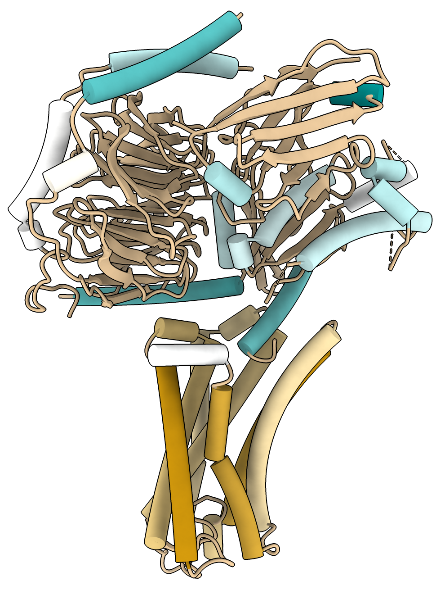

# Average lipophilicity to alpha helices

Here is Python code defining a command "helixmlp" that computes the average lipophilicity for each alpha helix.  The purpose was to color the helices by lipophilicity as a guide to which might be transmembrane.  The average is computed for every atom of the alpha helix weighted by its solvent accessible surface area of the helix alone.  The lipophilicity values are looked up for standard amino acids in the same way as the ChimeraX [mlp command](https://www.cgl.ucsf.edu/chimerax/docs/user/commands/mlp.html).  The average value for each helix is assigned to all residues of the helix as the attribute named "helix_lipophilicity" and can be used to color the helix using the ChimeraX [Render by Attribute tool](https://www.rbvi.ucsf.edu/chimerax/docs/user/tools/render.html) or the equivalant [color byattribute](https://www.rbvi.ucsf.edu/chimerax/docs/user/commands/color.html#byattribute) command.

To define the helixmlp command open [helixmlp.py](helixmlp.py) in ChimeraX

    open helixmlp.py

then open a structure and use the helixmlp command on it and color using, for example,

    open 8f76
    helixmlp #1
    preset cartoon cylinders
    color byattribute r:helix_lipophilicity #1 palette lipophilicity

This shows a GPCR transmembrane protein.  The orange helices are lipophilic and are in the lipid membrane while the blue helices on intracellular G proteins.

Here is the [helixmlp.py](helixmlp.py) code:

    # Color each helix to show how hydrophobic it is in order to highlight which helices
    # might be transmembrane.
    # To do this, for each atom in the helix consider its solvent accessible surface area
    # for that lone helix and multiply by the mlp lipophilicity of that atom, sum over
    # all atoms and divide by SAS area to get a area weighted lipophilicity value.
    # Then color the helices by that value.  Assign the average helix value to each
    # atom and to each residue in the helix so render by attribute can do the coloring.

    def sas_average_lipophilicity(session, residues):
        atoms = residues.atoms
        from chimerax.surface.measure_sasacmd import measure_sasa
        measure_sasa(session, atoms)

        lsum = 0
        asum = 0
        for a in atoms:
            a_lip = atom_lipophilicity(a)
            if a_lip is not None:
                lsum += a.area * a_lip
                asum += a.area
        ave_lipo = lsum / asum if asum > 0 else 0
        return ave_lipo

    _lipophilicity_table = None
    def atom_lipophilicity(atom):
        global _lipophilicity_table
        if _lipophilicity_table is None:
            from chimerax.mlp.mlp import Defaults
            lipophilicity = Defaults().fidatadefault
        rname = atom.residue.name
        if rname not in lipophilicity:
            return None
        l = lipophilicity[rname].get(atom.name)
        return l

    def helix_residues(residues):
        hlist = []
        hres = []
        from chimerax.atomic import Residues
        for r in residues:
            if r.is_helix:
                hres.append(r)
            elif hres:
                hlist.append(Residues(hres))
                hres = []
        if hres:
            hlist.append(Residues(hres))
        return hlist

    def helix_lipophilicity(session, residues):
        for hres in helix_residues(residues):
            ave_lipo = sas_average_lipophilicity(session, hres)
            for r in hres:
                r.helix_lipophilicity = ave_lipo
                for a in r.atoms:
                    a.helix_lipophilicity = ave_lipo
        from chimerax.atomic import Residue, Atom
        Residue.register_attr(session, 'helix_lipophilicity', 'Helix lipophilicity', attr_type = float)
        Atom.register_attr(session, 'helix_lipophilicity', 'Helix lipophilicity', attr_type = float)

    def register_command(logger):
        from chimerax.core.commands import register, CmdDesc
        from chimerax.atomic import ResiduesArg
        desc = CmdDesc(required = [('residues', ResiduesArg)],
                       synopsis='Set helix_lipophilicity attribute')
        register('helixmlp', desc, helix_lipophilicity, logger=logger)

    register_command(session.logger)

Tom Goddard, March 7, 2024
