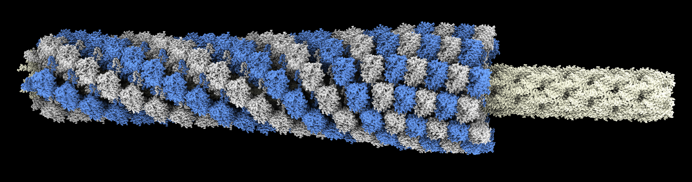

# Morph a phage helical tube

Here we morph a helical tube made of proteins from one pitch to another starting at one end and progressing to the other end in a wave.  This is a model of how phage tails contract to push a needle through a target cell through which the phage injects its genome.  The wave propagation is described in

    Quantitative description of a contractile macromolecular machine
    Alec Fraser, Nikolai S Prokhorov, Fang Jiao, B Montgomery Pettitt, Simon Scheuring, Petr G Leiman
    Sci Adv. 2021 Jun 11;7(24)

and we animate it for the phage T4 tail described in

    Cryo-EM Structure and Assembly of an Extracellular Contractile Injection System.
    Jiang F, Li N , Wang X, Cheng J, Huang Y, Yang Y, Yang J, Cai B, Wang YP, Jin Q, Gao N  
    Cell, 2019, 177, 370-383

We morph the extended helix (rise 39.3 Angstroms, twist 19.9 degrees) to the contracted helix (rise 17.0 Angstroms, twist 31.4 degrees) and the protein conformation from the extended structure PDB [6j0b](https://www.rcsb.org/structure/6j0b) to the contracted conformation PDB [6j0c](https://www.rcsb.org/structure/6j0c).

First I align a single 6-protein ring of the extended and contracted helices, center at the origin, adjust chain identifiers so they match, morph the conformation, and save this single ring morph as (6j0c_6j0b_morph.pdb)[6j0c_6j0b_morph.pdb] as shown in ChimeraX command script [helixalign.cxc](helixalign.cxc).  The script also saves the core needle tube (needle.cif)[needle.cif] which is inside the contracting helix and does not change.  Then I use the Python [helixwave.py](helixwave.py) code that defines the helixwave command to animate the wave transition from extended to contracted helix.  

    open helixalign.cxc
    close
    open needle.cif
    color #1 lightyellow
    open 6j0b_6j0c_morph.pdb coordset true
    color #2 lightgray
    color #2/A,C,E cornflowerblue
    light soft
    open helixwave.py
    helixwave #2 28

To record a [movie](helixwave.mp4)

    movie record ; helixwave #3 ; wait 300 ; movie encode helixwave.mp4
   
Here is the Python code [helixwave.py](helixwave.py)

<pre>
    # Animate Phage T4 sheath contraction as a wave starting at one end and progressing to other end.
    # Use PDB 3j0b extended (rise 17A, twist 31.4 degrees) and 3j0c (rise 39.3A, twist 19.9 degrees),
    # 28 layers.
    #
    # We animate each of the 28 layers using a total rotation and translation about the sheath axis,
    # and a conformation change of the monomers from extended to contracted.  We treat the top layer
    # as fixed in rotation and translation where the sheath joins the virus capsid, and the bottom
    # layer at the target cell surface rotates and retracts.  Could have instead the bottom layer
    # not rotate or translate and have the top layer rotate and descend.  Not sure what is physically
    # correct.  The tube needs to puncture the membrane but I'm not sure if the virus head moves
    # towards the cell membrane or the cell membrane is tugged toward the virus head during contraction.
    #
    # This animation is a bit tricky because rotating and translating one layer also rotates and
    # translates all the layers below it.
    #

    def animate_wave(layer_models, num_time_steps = 300, wave_length = 0.5,
                     rise_start = 39.3, rise_end = 17.0, twist_start = 19.9, twist_end = 31.4):
        def wave(session, frame, layer_models=layer_models, num_time_steps=num_time_steps,
                 wave_length=wave_length, rise_start=rise_start, rise_end=rise_end,
                 twist_start=twist_start, twist_end=twist_end):
            time = frame/(num_time_steps-1)
            show_wave(layer_models, time, wave_length,
                      rise_start, rise_end, twist_start, twist_end)
        from chimerax.core.commands.motion import CallForNFrames
        CallForNFrames(wave, num_time_steps, layer_models[0].session)

    def show_wave(layer_models, time, wave_length, rise_start, rise_end, twist_start, twist_end):
        ztrans = zrot = 0
        profile = wave_profile(time, len(layer_models), wave_length)
        for layer_model, f in zip(layer_models, profile):
            ztrans += (1-f) * rise_start + f * rise_end
            zrot += (1-f) * twist_start + f * twist_end
            from chimerax.geometry import translation, rotation
            layer_model.position = translation((0,0,ztrans)) * rotation((0,0,1), zrot)
            coordset_ids = layer_model.coordset_ids
            layer_model.active_coordset_id = coordset_ids[int(f * (len(coordset_ids)-1))]

    def wave_profile(time, num_layers, wave_length):
        '''
        Return fraction contracted for each layer at a given time.  Last layer contracts first.
        Time ranges from 0 to 1, fully extended to fully contracted.
        '''
        l0 = (1 - time * (1 + wave_length))*(num_layers-1)
        l1 = l0 + wave_length * num_layers
        profile = []
        for layer in range(num_layers):
            if layer <= l0:
                f = 0
            elif layer >= l1:
                f = 1
            else:
                f = (layer-l0)/(l1-l0)
            profile.append(f)
        return profile

    def helix_wave(session, layer_models, num_layers = 28, time = None, steps = 300, wave_length = 0.5,
                   rise_start = 39.3, rise_end = 17.0, twist_start = 19.9, twist_end = 31.4):
        '''
        If a single model is specified then num_layers copies will be made, otherwise
        the specified models will be treated as the layers.
        The layer model should be a morph of a single layer between the two helix states
        centered at the origin (0,0,0) with tube axis along z.
        '''
        if len(layer_models) == 1:
            layer_model = layer_models[0]
            layer_models = [layer_model.copy() for l in range(num_layers)]
            session.models.add_group(layer_models)
            layer_model.display = False
        if time is None:
            animate_wave(layer_models, steps, wave_length, rise_start, rise_end, twist_start, twist_end)
        else:
            show_wave(layer_models, time, wave_length, rise_start, rise_end, twist_start, twist_end)

    def register_command(session):
        from chimerax.core.commands import CmdDesc, register, FloatArg, IntArg
        from chimerax.atomic import AtomicStructuresArg
        desc = CmdDesc(required=[('layer_models', AtomicStructuresArg)],
                       optional=[('num_layers', IntArg)],
                       keyword=[('time', FloatArg),
                                ('steps', IntArg),
                                ('wave_length', FloatArg),
                                ('rise_start', FloatArg),
                                ('rise_end', FloatArg),
                                ('twist_start', FloatArg),
                                ('twist_start', FloatArg),
                                ],
                       synopsis='Morph a twist and contract wave along a helical filament')
        register('helixwave', desc, helix_wave, logger=session.logger)

    register_command(session)
</pre>

Tom Goddard, September 11, 2022
