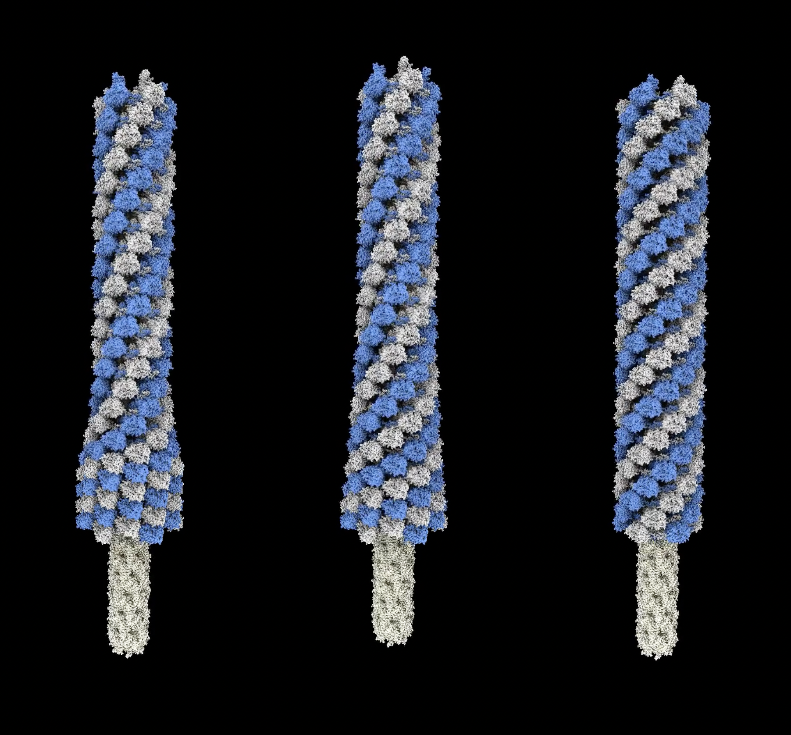

# Morph a phage helical tube

Here we morph a helical tube made of proteins from one pitch to another starting at one end and progressing to the other end in a wave.  This is a model of how phage tails contract to push a needle through a target cell through which the phage injects its genome.  The wave propagation is described in

    [Quantitative description of a contractile macromolecular machine](https://pubmed.ncbi.nlm.nih.gov/34117062/)
    Alec Fraser, Nikolai S Prokhorov, Fang Jiao, B Montgomery Pettitt, Simon Scheuring, Petr G Leiman
    Sci Adv. 2021 Jun 11;7(24)

and we animate it for the phage T4 tail described in

    [Cryo-EM Structure and Assembly of an Extracellular Contractile Injection System.](https://pubmed.ncbi.nlm.nih.gov/30905475/)
    Jiang F, Li N , Wang X, Cheng J, Huang Y, Yang Y, Yang J, Cai B, Wang YP, Jin Q, Gao N  
    Cell, 2019, 177, 370-383

We morph the extended helix (rise 39.3 Angstroms, twist 19.9 degrees) to the contracted helix (rise 17.0 Angstroms, twist 31.4 degrees) and the protein conformation from the extended structure PDB [6j0b](https://www.rcsb.org/structure/6j0b) to the contracted conformation PDB [6j0c](https://www.rcsb.org/structure/6j0c).

First I align a single 6-protein ring of the extended and contracted helices, center at the origin, adjust chain identifiers so they match, morph the conformation, and save this single ring morph as [6j0c_6j0b_morph.pdb](6j0c_6j0b_morph.pdb) as shown in ChimeraX command script [helixalign.cxc](helixalign.cxc).  The script also saves the core needle tube [needle.cif](needle.cif) which is inside the contracting helix and does not change.  Then I use the Python [helixwave.py](helixwave.py) code that defines the helixwave command to animate the wave transition from extended to contracted helix.  

    open helixalign.cxc
    close
    open needle.cif
    color #1 lightyellow
    open 6j0b_6j0c_morph.pdb coordset true
    color #2 lightgray
    color #2/A,C,E cornflowerblue
    light soft
    open helixwave.py
    helixwave #2 28 move #1

To record a movie

    movie record ; helixwave #3 move #1 ; wait 300 ; movie encode helixwave.mp4

or using a smaller contraction zone (0.2 times full length)

    movie record ; helixwave #3 wavelength 0.2 move #1 ; wait 300 ; movie encode helixwave_0.2.mp4

or uniform contraction zone

    movie record ; helixwave #3 uniform true move #1 ; wait 300 ; movie encode helixwave_uniform.mp4

Here is a [movie](hwave.mp4) of the 0.2 wavelength, 0.5 wavelength and uniform motion side by side.
This can be used in an [animation including the phage capsid and baseplate](https://www.rbvi.ucsf.edu/chimerax/data/phage-T4-sep2022/phageT4.html).

Here is the Python code [helixwave.py](helixwave.py)

<pre>
    #
    # Animate Phage T4 sheath contraction as a wave starting at the tip and progressing to the capsid.
    # Use PDB 3j0b extended (rise 17A, twist 31.4 degrees) and 3j0c (rise 39.3A, twist 19.9 degrees),
    # 28 layers.
    #
    # We animate each of the 28 layers using a rotation and translation about the sheath axis,
    # and a conformation change of the monomers from extended to contracted.  The first layer is at
    # z = 0 and layers are stacked in z.  The last layer is the tip and does not rotate or
    # translate.  The first layer (where the virus capsid is attached) rotates and moves along z
    # and additional models such as a capsid and needle model can be moved with it using the
    # move_models parameter.
    #
    # This animation is a bit tricky because rotating and translating one layer also rotates and
    # translates all the layers at lower z.
    #

    def helix_wave(session, layer_models, num_layers = 28, time = None, steps = 300,
                   wave_length = 0.5, uniform = False,
                   rise_start = 39.3, rise_end = 17.0, twist_start = 19.9, twist_end = 31.4,
                   move_models = None):
        '''
        If a single model is specified then num_layers copies will be made, otherwise
        the specified models will be treated as the layers.
        The layer model should be a morph of a single layer between the two helix states
        centered at the origin (0,0,0) with tube axis along z.
        '''
        if len(layer_models) == 1:
            layer_model = layer_models[0]
            layer_models = [layer_model.copy() for l in range(num_layers)]
            session.models.add_group(layer_models)
            layer_model.display = False

        if time is None:
            def wave(session, frame):
                time = frame/(steps-1)
                show_wave(layer_models, time, wave_length, uniform,
                          rise_start, rise_end, twist_start, twist_end, move_models)
            from chimerax.core.commands.motion import CallForNFrames
            CallForNFrames(wave, steps, layer_models[0].session)
        else:
            show_wave(layer_models, time, wave_length, uniform,
                      rise_start, rise_end, twist_start, twist_end, move_models)

    def show_wave(layer_models, time, wave_length, uniform,
                  rise_start, rise_end, twist_start, twist_end, move_models = None):
        ztrans = zrot = 0
        profile = wave_profile(time, len(layer_models), wave_length, uniform)
        for layer_model, f in zip(layer_models, profile):
            ztrans += (1-f) * rise_start + f * rise_end
            zrot += (1-f) * twist_start + f * twist_end
            from chimerax.geometry import translation, rotation
            layer_model.position = translation((0,0,ztrans)) * rotation((0,0,1), zrot)
            coordset_ids = layer_model.coordset_ids
            layer_model.active_coordset_id = coordset_ids[int(f * (len(coordset_ids)-1))]

        # Keep the helix tip fixed
        nlayer = len(layer_models)
        height, twist = (nlayer-1)*rise_start, (nlayer-1)*twist_start
        start_tip_position = translation((0,0,height)) *  rotation((0,0,1), twist)
        r = start_tip_position * layer_models[-1].position.inverse()
        for m in layer_models:
            m.position = r * m.position

        # Move models as if fixed to the helix base.
        if move_models is not None:
            r = layer_models[0].position
            for m in move_models:
                if not hasattr(m, '_wave_start_positions'):
                    m._wave_start_positions = m.positions
                m.positions = r * m._wave_start_positions

    def wave_profile(time, num_layers, wave_length, uniform):
        '''
        Return fraction contracted for each layer at a given time.  Last layer contracts first.
        Time ranges from 0 to 1, fully extended to fully contracted.
        '''
        if uniform:
            profile = [time]*num_layers
        else:
            l0 = (1 - time * (1 + wave_length))*(num_layers-1)
            l1 = l0 + wave_length * num_layers
            profile = []
            for layer in range(num_layers):
                if layer <= l0:
                    f = 0
                elif layer >= l1:
                    f = 1
                else:
                    f = (layer-l0)/(l1-l0)
                profile.append(f)
        return profile

    def register_command(session):
        from chimerax.core.commands import CmdDesc, register, FloatArg, IntArg, BoolArg
        from chimerax.atomic import AtomicStructuresArg
        desc = CmdDesc(required=[('layer_models', AtomicStructuresArg)],
                       optional=[('num_layers', IntArg)],
                       keyword=[('time', FloatArg),
                                ('steps', IntArg),
                                ('wave_length', FloatArg),
                                ('uniform', BoolArg),
                                ('rise_start', FloatArg),
                                ('rise_end', FloatArg),
                                ('twist_start', FloatArg),
                                ('twist_end', FloatArg),
                                ('move_models', AtomicStructuresArg),
                                ],
                       synopsis='Morph a twist and contract wave along a helical filament')
        register('helixwave', desc, helix_wave, logger=session.logger)

    register_command(session)
</pre>

Tom Goddard, September 11, 2022
