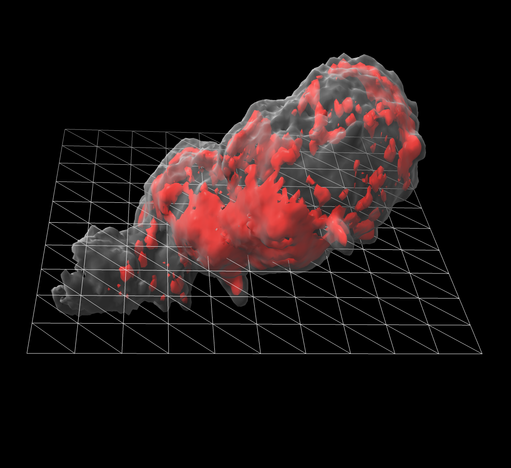
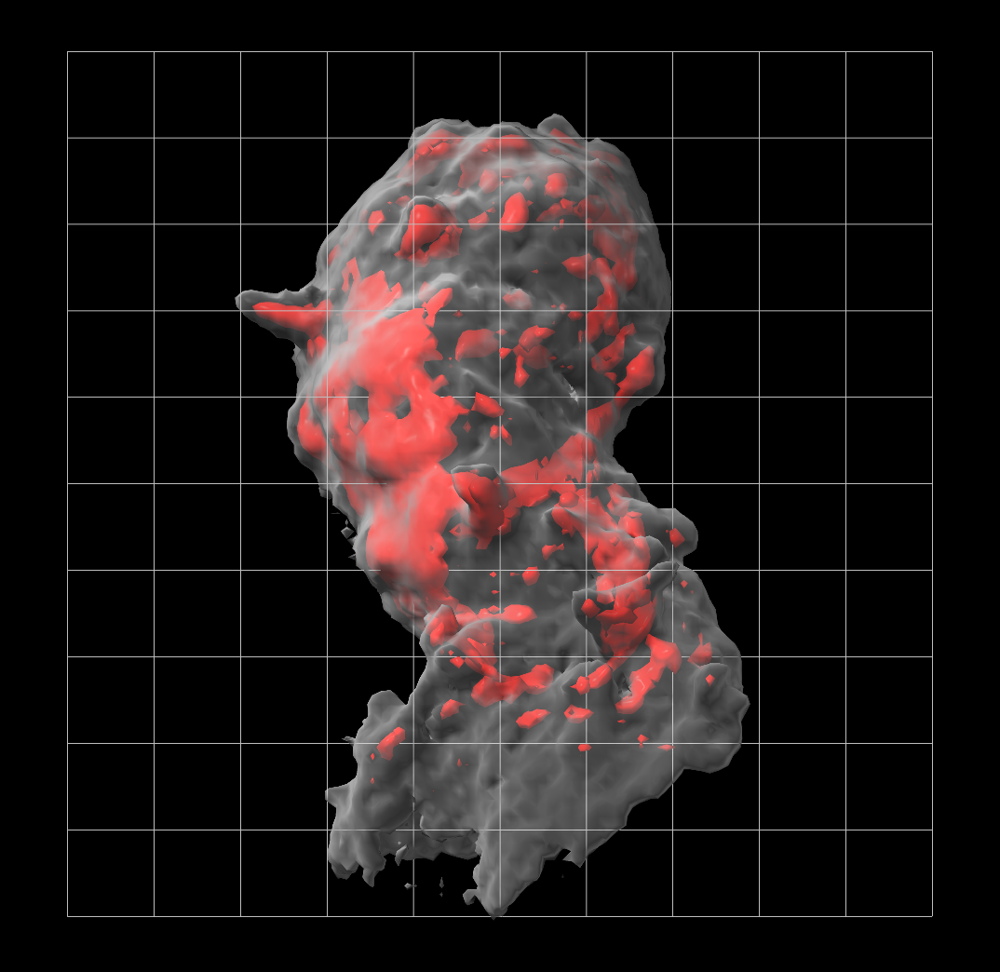

# Hide diagonal lines of a mesh surface

Here is some ChimeraX Python code that hides lines of a mesh that are not parallel the x or y or z axes.  Ilhan Tomris [asked](https://plato.cgl.ucsf.edu/pipermail/chimerax-users/2020-October/001577.html) about how to show a grid on light microscopy data.  The [shape](https://www.cgl.ucsf.edu/chimerax/docs/user/commands/shape.html) command can show a rectangle, and the [surface style](https://www.cgl.ucsf.edu/chimerax/docs/user/commands/surface.html#style) command can display it as a mesh.

     shape rectangle width 20 height 20
     surface style #3 mesh

But the rectangle is made up of triangles so the mesh shows triangles.  The Python code [hide_diagonals.py](hide_diagonals.py) below define a command hidediagonals that hides the lines that are not parallel x or y or z axes.

I also added this to ChimeraX as the [surface squaremesh](https://www.cgl.ucsf.edu/chimerax/docs/user/commands/surface.html#sop) command.

<pre>
# Define command hidediagonals that hides edges of a mesh surface that are not parallel
# the x, or y, or z axes.  This was to make a square grid to overlay on microscopy data.

def hide_diagonals(session, surface):
    vertices = surface.vertices
    from numpy import array, uint8
    edge_mask = array([diagonal_mask(t, vertices) for t in surface.triangles], uint8)
    surface.edge_mask = edge_mask

def diagonal_mask(triangle, vertices):
    '''
    The edge mask uses the lowest 3 bits to indicate which of the 3 edges
    of a triangles should be shown.
    '''
    i0,i1,i2 = triangle
    v0,v1,v2 = vertices[i0],vertices[i1],vertices[i2]
    mask = 0
    if parallel_x_or_y_or_z(v0,v1):
        mask |= 0x1
    if parallel_x_or_y_or_z(v1,v2):
        mask |= 0x2
    if parallel_x_or_y_or_z(v2,v0):
        mask |= 0x4
    return mask

def parallel_x_or_y_or_z(xyz1,xyz2):
    return (xyz1 == xyz2).sum() >= 2

def register_hide_diagonals_command(logger):
    from chimerax.core.commands import CmdDesc, register, SurfaceArg
    desc = CmdDesc(
        required = [('surface', SurfaceArg)],
        synopsis = 'Hide diagonal of surface mesh'
    )
    register('hidediagonals', desc, hide_diagonals, logger=logger)

register_hide_diagonals_command(session.logger)

</pre>

Tom Goddard, October 18, 2020
