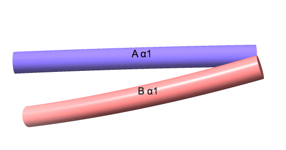

# Label secondary structure elements

Here is Python code that places labels on secondary structure elements. The labels contain either &alpha; (helix) or &beta; (strand) and the number of the element in its chain.  If the structure has more than one chain, then each label will be preceded with the chain ID.  Opening the label_ss.py code in ChimeraX places the labels

    open label_ss.py

You can adjust the size of the labels by editing the first line of the file, or afterward with the "label height" command, *e.g.*

    label height 4
    
The script actually issues label commands to place the labels, and those commands are shown in the log.  So if you want to label fewer things you could take those commands and remove the residues corresponding to the secondary structure elements you don't want labeled.  You would remove existing labels with

	label delete

Here is what labeling 1zik looks like

Here is the [label_ss.py](label_ss.py) code:

    label_height = 2

    from chimerax.atomic import all_atomic_structures
    for s in all_atomic_structures(session):
        helix_label_targets = []
        strand_label_targets = []
        cur_key = None

        ss_run = []
        for r in s.residues:
            if r.ss_type == r.SS_COIL:
                key = None
            else:
                key = (r.chain_id, r.ss_type, r.ss_id)
            if key == cur_key:
                if key is not None:
                    ss_run.append(r)
                continue
            if cur_key is not None:
                mid_res = ss_run[int(len(ss_run)/2)]
                if cur_key[0] == r.SS_HELIX:
                    helix_label_targets.append(mid_res)
                else:
                    strand_label_targets.append(mid_res)
            ss_run = []
            if key is not None:
                ss_run.append(r)
            cur_key = key
        if cur_key is not None:
            mid_res = ss_run[int(len(ss_run)/2)]
            if cur_key[0] == r.SS_HELIX:
                helix_label_targets.append(mid_res)
            else:
                strand_label_targets.append(mid_res)

        from chimerax.core.commands import run
        from chimerax.atomic import concise_residue_spec
        prefix = '{0.chain_id} ' if s.num_chains > 1 else ""
        if helix_label_targets:
            run(session, "label %s residues text '%sα{0.ss_id}' height %g" % (concise_residue_spec(session,
                helix_label_targets), prefix, label_height))
        if strand_label_targets:
            run(session, "label %s residues text '%sβ{0.ss_id}' height %g" % (concise_residue_spec(session,
                strand_label_targets), prefix, label_height))
