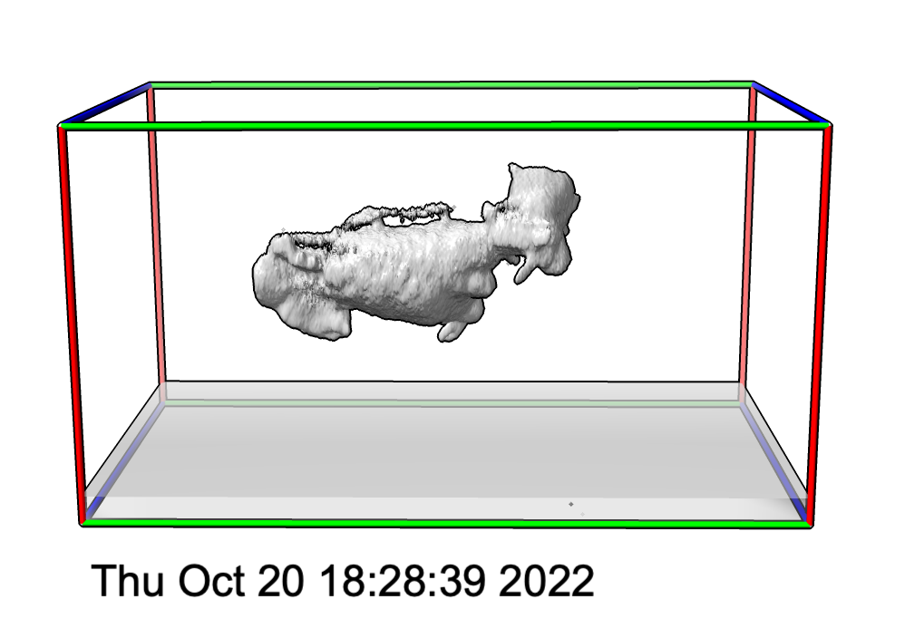

# Colored axes, coverslip and timestamp

Shayne Quinn [asked](https://www.rbvi.ucsf.edu/pipermail/chimerax-users/2022-October/004467.html) about axis colored outline boxes for lightsheet microscopy data, showing a cover slip as a gray rectangle, and showing a time stamp, on the ChimeraX mailing list.  Below is Python code defining 3 ChimeraX commands to show those things.  Opening the Python code in ChimeraX defines the commands.

    open lightsheet.py

And here is an example use of the 3 commands.

    open cell15.am
    outline #1
    coverslip #1 thickness 2
    timestamp

There are additional options to these commands to set axis thickness, colors (name or red,green,blue,opacity), and timestamp position that you can see in the Python code.  Here are examples of these options.

      outline #1 edgeRadius .5
      coverslip #1 color lightblue
      coverslip #1 color 90,90,90,30
      timestamp xpos .5 ypos .9 color yellow
      
Here is the Python code [lightsheet.py](lightsheet.py)

<pre>
    #
    # Shayne Quinn asked about axis colored outline boxes for lightsheet data,
    # showing a cover slip as a gray rectangle, and showing a time stamp, on
    # the ChimeraX mailing list:
    #
    # https://www.rbvi.ucsf.edu/pipermail/chimerax-users/2022-October/004467.html
    #
    def colored_volume_outline(session, volume, edge_radius = None):

        # First create a box outline around the volume with the shape command.
        xyz_min, xyz_max = volume.xyz_bounds()
        xsize,ysize,zsize = [x2-x1 for x1,x2 in zip(xyz_min, xyz_max)]
        xmid,ymid,zmid = [0.5*(x1+x2) for x1,x2 in zip(xyz_min, xyz_max)]
        shape_cmd = f'shape rectangle width {xsize} height {ysize} slab {zsize} center {xmid},{ymid},{zmid} widthdivisions 1 heightdivisions 1 mesh true'
        from chimerax.core.commands import run
        s = run(session, shape_cmd)

        # Eliminate the diagonal lines in the outline box
        run(session, f'surface squaremesh {s.atomspec}')

        # Convert the outline box to a fake molecule with atoms and bonds.
        if edge_radius is None:
            edge_radius = max(volume.data.step)  # Use grid spacing for edge radius.
        m = run(session, f'marker fromMesh {s.atomspec} edgeRadius {edge_radius}')
        run(session, f'rename {m.atomspec} "Colored axes"')

        # Close the outline.
        run(session, f'close {s.atomspec}')

        # Color the bonds.
        red, green, blue = (255,0,0,255), (0,255,0,255), (0,0,255,255) # RGBA values
        axis_colors = {0: blue, 1: green, 2: red}
        for b in m.bonds:
            a1,a2 = b.atoms
            from numpy import absolute
            axis = absolute(a2.coord - a1.coord).argmax()
            b.color = axis_colors[axis]

        return m

    def cover_slip(session, volume, thickness = 1, color = (180,180,180,80)):

        # First create a rectangular with the shape command near the z=0 face of the volume.
        xyz_min, xyz_max = volume.xyz_bounds()
        xyz_max[2] = thickness
        xsize,ysize,zsize = [x2-x1 for x1,x2 in zip(xyz_min, xyz_max)]
        xmid,ymid,zmid = [0.5*(x1+x2) for x1,x2 in zip(xyz_min, xyz_max)]
        from chimerax.core.colors import hex_color
        shape_cmd = f'shape rectangle width {xsize} height {ysize} slab {zsize} center {xmid},{ymid},{zmid} color {hex_color(color)} name coverslip'
        from chimerax.core.commands import run
        s = run(session, shape_cmd)
        return s

    def time_stamp(session, xpos = .1, ypos = .05, color = None):
        from datetime import datetime
        date = datetime.now().ctime()
        from chimerax.core.commands import run
        label = run(session, f'2dlabel text "{date}" xpos {xpos} ypos {ypos}')
        return label

    def register_command(session):
        from chimerax.core.commands import CmdDesc, register, FloatArg, Color8Arg
        from chimerax.map import MapArg
        desc = CmdDesc(required=[('volume', MapArg)],
                       keyword=[('edge_radius', FloatArg)],
                       synopsis='Show red,blue,green colored volume outline box')
        register('outline', desc, colored_volume_outline, logger=session.logger)

        desc = CmdDesc(required=[('volume', MapArg)],
                       keyword=[('thickness', FloatArg),
                                ('color', Color8Arg)],
                       synopsis='Show rectangular box at base of map')
        register('coverslip', desc, cover_slip, logger=session.logger)

        desc = CmdDesc(keyword=[('xpos', FloatArg),
                                ('ypos', FloatArg),
                                ('color', Color8Arg)],
                       synopsis='Show timestamp label')
        register('timestamp', desc, time_stamp, logger=session.logger)

    register_command(session)
</pre>

Tom Goddard, October 20, 2022
