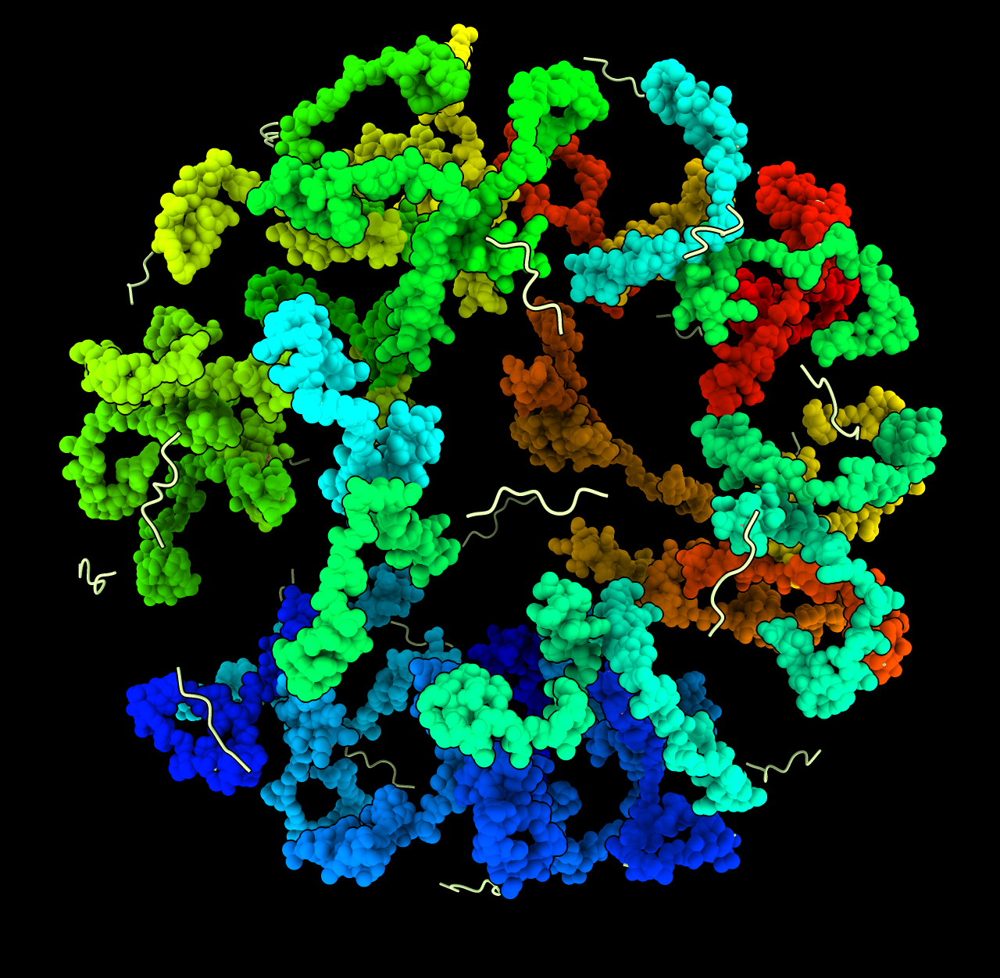

# Place peptide linkers using molecular dynamics

I wanted to attach the C-terminal tails of 40 ferritin proteins [PDB 5n5f](https://www.rcsb.org/structure/5n5f) to the inside of an icosahedral shell made from 60 encapsulin proteins [PDB 7oe2](https://www.rcsb.org/structure/7oe2) described [here](https://www.rbvi.ucsf.edu/chimerax/data/encapsulin-mar2022/encapsulin.html).  The ferritin C-terminus contains a 9 amino acid peptide that binds to a groove in encapsulin.  From electron microscopy [EMD 12873](https://www.emdataresource.org/EMD-12873) I know the positions of the proteins but the linkers are not observed.  The Python code here pulls the C-terminal recognition signal into alignment with a nearby encapsulin protein groove for each of the 40 ferritin proteins.

ChimeraX has a [tug](https://www.cgl.ucsf.edu/chimerax/docs/user/commands/tug.html) command that can run molecular dynamics while tugging specified atoms towards target stationary templates.  The code here runs the tug command 40 times on 40 copies of the C-terminal linker sequence tugging one end to join the ferritin protein and the other end to the encapsulin groove which has a docked template signal sequence.  First the start of a linker is rigidly [aligned](https://www.cgl.ucsf.edu/chimerax/docs/user/commands/align.html) to the ferritin, then the tugging is run.

The Python code defines a new "link" command that aligns, finds a nearby template end and tugs.  Opening the Python code in ChimeraX defines the "link" command

    open link.py

The 40 ferritin proteins, 60 encapsulin proteins, and 40 linker peptides are in ChimeraX 1.3 session file [encapsulin_link.cxs](encapsulin_link.cxs).

    open encapsulin_link.cxs
    link linkerStart #4:92-96@N,CA,C linkerEnd #4:117-125@N,CA,C templateStart #3:92-96@N,CA,C templateEnd #2:917-925@N,CA,C

[Animation](encapsulin_link.mp4)

<video width="640" height="640" controls>
  <source src="encapsulin_link.mp4" type="video/mp4">
  
</video>

Here is the [link.py](link.py) code:

    def link(session, linker_start, linker_end, template_start, template_end,
             force_constant = 1000, steps = 100, frames = 50):
        '''
        Connect several linkers between starting and ending templates.
        A linker's start atoms are aligned to a starting template and then the linker's end
        atoms are tugged towards a nearby ending template using molecular dynamics.

        Each linker has its start atoms rigidly aligned to a start template.
        The end template for a linker is chosen as the closest to the template start that
        is not yet used.  The start atoms for all linkers are in linker_start and each linker
        is a separate model.  Likewise the end atoms to match for all linkers are in linker_end.

        The template start atoms must be in the same order and equal in number to the linker
        start atoms, and each template start must be a separate chain.  There must be the
        same number of template start chains as there are linkers and they are paired with
        linkers in order.

        The template end atoms must match in order the linker end atoms.
        Each template end must be in a separate chain, and there must be at least as
        many template ends as there are linkers.
        '''
        lstart = {s:latoms for (s,latoms) in linker_start.by_structure}
        lend = {s:latoms for (s,latoms) in linker_end.by_structure}
        lpairs = [(latoms, lend[s]) for s,latoms in lstart.items()]
        tstart = [catoms for (s,cid,catoms) in template_start.by_chain]
        tend = [catoms for (s,cid,catoms) in template_end.by_chain]
        used = set()  # Used template ends
        from chimerax.std_commands.align import align
        from chimerax.tug.tugcommand import tug
        from chimerax.atomic import concatenate
        for (ls,le),ts in zip(lpairs, tstart):
            # Find which template end to use
            i0, i1 = nearest_linker_atoms(ls, le)
            tavailable = [te for te in tend if id(te) not in used]
            te = closest_template_end(ts[i0].scene_coord, tavailable, i1)
            used.add(id(te))
            # Align linker start to template start
            align(session, ls, ts, log_info = False)
            # Tug linker end to template end and linker start to template start.
            tug(session, concatenate((ls,le)), concatenate((ts,te)),
                force_constant = force_constant, steps = steps, frames = frames,
                finish = True)

    def nearest_linker_atoms(start_atoms, end_atoms):
        '''Find atom indices of atoms closest in sequence number.'''
        s = sorted(start_atoms, key = lambda a: a.residue.number)
        e = sorted(end_atoms, key = lambda a: a.residue.number)
        if start_atoms[0].residue.number < end_atoms[0].residue.number:
            a0,a1 = s[-1], e[0]
        else:
            a0,a1 = s[0], e[-1]
        return start_atoms.index(a0), end_atoms.index(a1)

    def closest_template_end(xyz, template_ends, atom_index):
        from chimerax.geometry import distance
        dists = [(distance(xyz, te[atom_index].scene_coord), te) for te in template_ends]
        return min(dists)[1]

    def register_command(logger):
        from chimerax.core.commands import register, CmdDesc, FloatArg, IntArg
        from chimerax.atomic import AtomsArg
        desc = CmdDesc(keyword = [('linker_start', AtomsArg),
                                  ('linker_end', AtomsArg),
                                  ('template_start', AtomsArg),
                                  ('template_end', AtomsArg),
                                  ('force_constant', FloatArg),
                                  ('steps', IntArg),
                                  ('frames', IntArg),
                                  ],
                       required_arguments = ['linker_start', 'linker_end',
                                             'template_start', 'template_end'],
                       synopsis='Position linkers')
        register('link', desc, link, logger=logger)

    register_command(session.logger)

Tom Goddard, March 18, 2022
