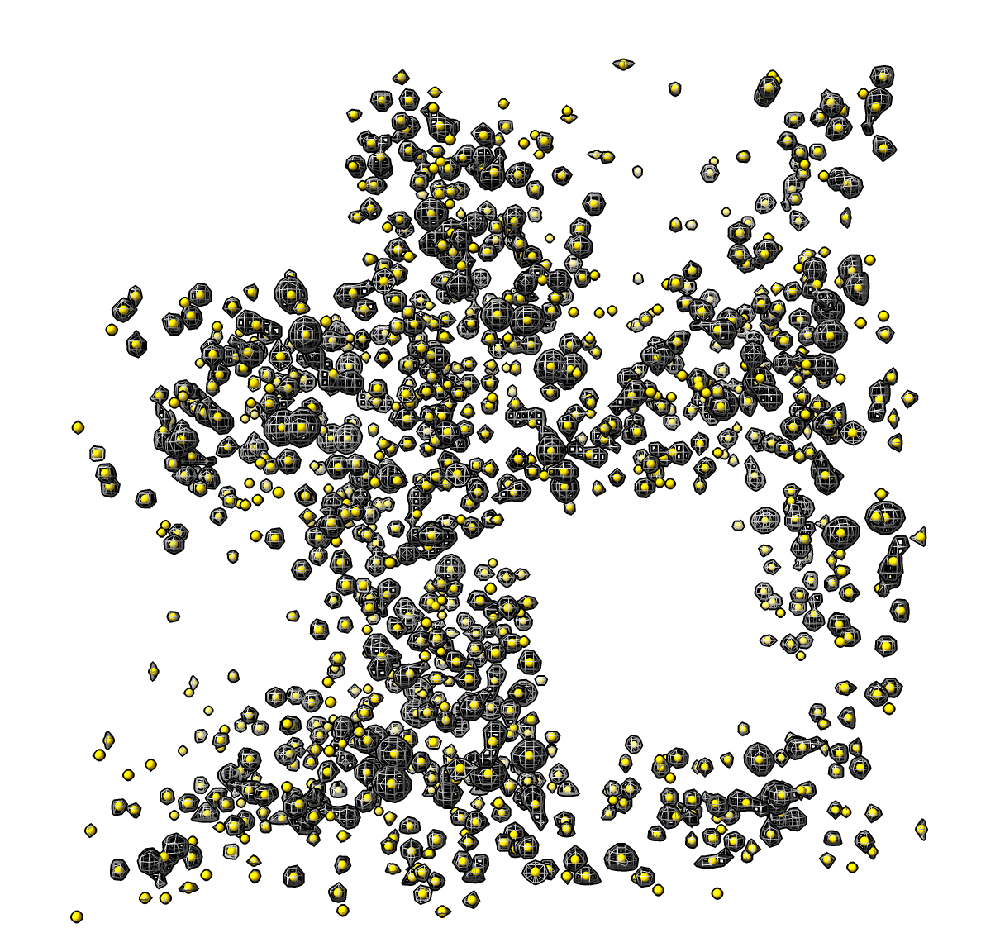

# Mark Connected Pieces of a Surface

Here is some ChimeraX Python code that puts a spherical marker at the center of each connected piece of a surface.  Brandon Scott [asked](https://plato.cgl.ucsf.edu/pipermail/chimerax-users/2020-October/001553.html) about this for tracking blobs in 3D light microscopy.   I pieced to together this code by looking at two existing ChimeraX features: the [mouse mode](https://www.cgl.ucsf.edu/chimerax/docs/user/tools/markers.html) for placing a marker at the center of a connected surface piece, and the [surface dust](https://www.cgl.ucsf.edu/chimerax/docs/user/commands/surface.html#dust) command that hides all small connected surface pieces.

The Python code [mark_blobs.py](mark_blobs.py) when opened in ChimeraX defines the markblobs command.  Here is an example use marking each blob of the X-ray density for PDB crystal structure 1a0m

    open ~/Downloads/mark_blobs.py
    open 1a0m from eds
    markblobs #1 radius 0.2 color gold

Here is the bit that computes the centers

{{{

def surface_blob_centers(surface):
    '''
    Return an array of center positions for each connected set of
    displayed triangles in the surface.  Centers are in surface coordinates.
    A center is computed as average vertex position weighted by vertex area
    where vertex area is 1/3 the area of the adjoining displayed triangles.
    '''

    # Get list of (vertex indices, triangle indices) for each connected piece
    triangles = surface.masked_triangles
    from chimerax.surface import connected_pieces, vertex_areas
    blob_list = connected_pieces(triangles)

    # Compute area-weighted center for each blob
    vertices = surface.vertices
    varea = vertex_areas(vertices, triangles)
    from numpy import empty, float32
    centers = empty((len(blob_list), 3), float32)
    for i, (vi,ti) in enumerate(blob_list):
        blob_varea = varea[vi]
        blob_area = blob_varea.sum()
        centers[i] = blob_varea.dot(vertices[vi])/blob_area

    return centers
}}}

And here is some Python to define a command "markcenters" that runs this.

{{{
def markblobs(session, surface, radius = 0.5, color = (255,255,0,255)):
    centers = surface_blob_centers(surface)
    scene_centers = surface.scene_position * centers
    from chimerax.markers import MarkerSet
    marker_set = MarkerSet(session, name = surface.name)
    markers = [marker_set.create_marker(center, color, radius) for center in scene_centers]
    session.models.add([marker_set])
    session.logger.status('Found %d connected surface pieces' % len(markers), log = True)
    return markers
    
def register_command(logger):
    from chimerax.core.commands import CmdDesc, register, SurfaceArg, FloatArg, Color8Arg
    desc = CmdDesc(
        required = [('surface', SurfaceArg)],
        keyword = [('radius', FloatArg),
                   ('color', Color8Arg)],
        synopsis = 'Place markers at center of each connected surface blob'
    )
    register('markblobs', desc, markblobs, logger=logger)

register_command(session.logger)
}}}

Tom Goddard, October 8, 2020
