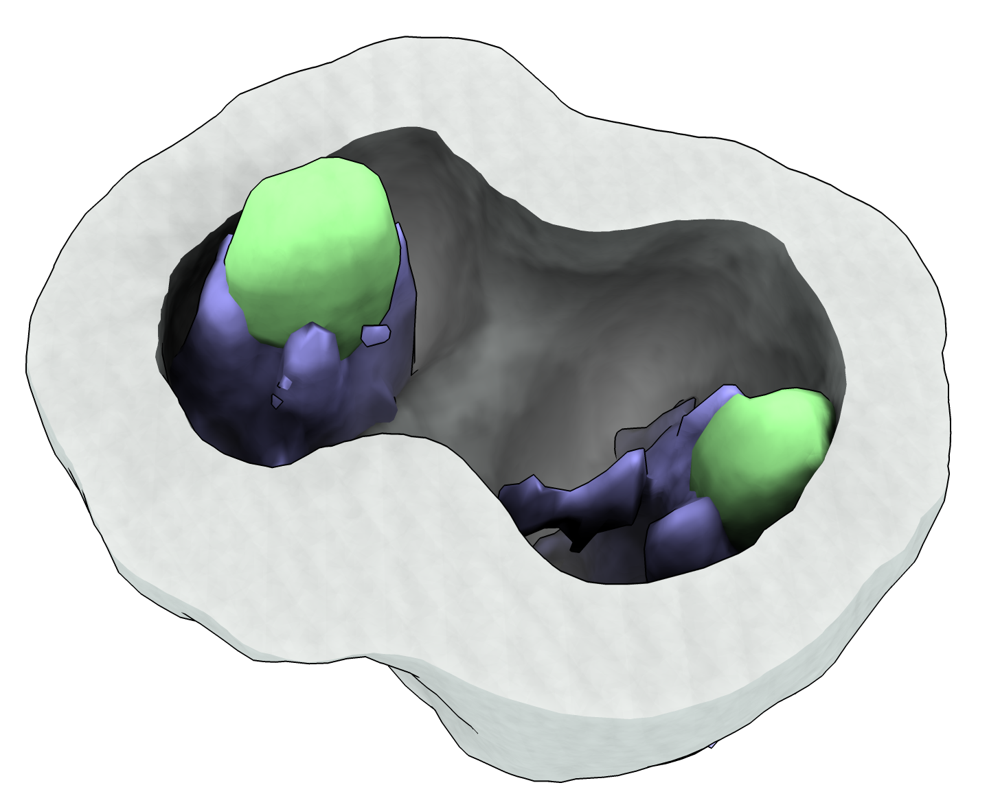
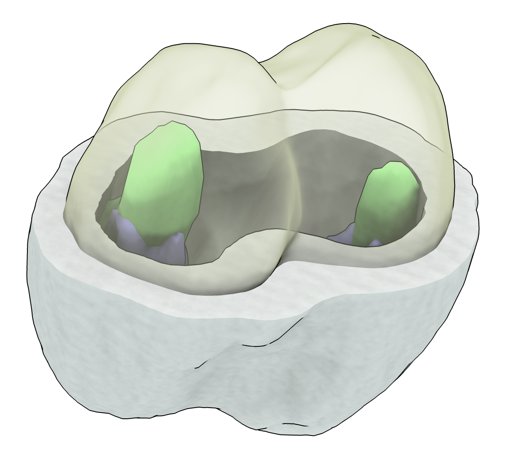
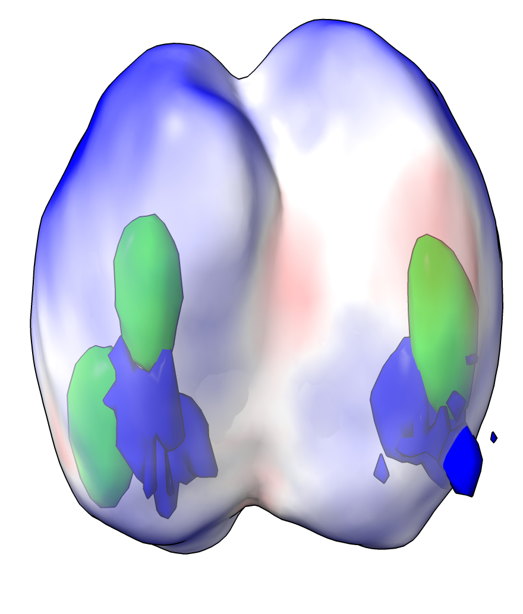

# Move a surface to highest intensity in 3D microscope image

A fluorescently labeled membrane will be seen in 3D microscopy with a thickness that is much greater than the actual membrane due to limited microscope resolution.  Here is a ChimeraX command that tries to place a surface at the highest intensity in the middle of the shell seen in a 3D microscope image.  It starts with surfaces at a specified intensity level (an isosurface).  That will show inner and outer surfaces of the shell.  The command moves those surfaces toward higher intensity following the intensity gradient.

To define the midsurf command open the Python code [midsurf.py](midsurf.py) with ChimeraX command

    open midsurf.py

And here is an example opening a 3-channel 3D microscope image [cell14.tif](cell14.tif) and moving the isosurfaces for channel 1.

    open cell14.tif
    volume #1.1 level X
    midsurf #1.1

The midsurf command can be run multiple times until it the surface coverges to the highest intensity position.  The first image shows the cell with the membrane cut in half, and the second image shows the computed middle surface in transparent yellow.

|---|---|
|||

## More Options

The midsurf command has several additional options

    midsurf #2 volume #1 steps 100 voxelStep 0.1 smoothingIterations 1 smoothingFactor 0.1

You can specify an initial surface to move (#2 in the example) that is not a map isosurface and then you also need to specify the map ("volume #1" in the example).  The motion is done in steps, by default 100 steps, each step moving at most a certain fraction of the grid spacing (voxelStep 0.1) perpendicular to the surface.  To avoid creases in the surface the vertices are also moved toward the average of the neighbor vertices at each step.  That smoothing is does some number of iterations (smoothingIterations 1) moving each vertex a fraction of the way (smoothingFactor 0.1) to the average neighbor position.  The smoothing can make the surface smaller, contracting a spherical surface, and can pull the surface away from the intensity maximum.  It is useful to try "smoothingIterations 0" after the surface is moved to see if it changes the position.

## Surface Coloring

The middle surface can be colored according to the image intensity using menu Tools / Volume Data / Surface Color or the equivalent command

    color sample #1.1 map #1.1 palette bluered
    transparency #1.1 50

Here is the Python code [midsurf.py](midsurf.py)

<pre>
    # Move surface vertices along a volume gradient until they reach a maximum.
    # Move them normal to the surface and keep the vertices and normals uniform
    # by smoothing frequently.
    #
    # This is to find the center cell membrane surface in a roughly spherical shell
    # seen in light microscopy.  For Arthur Charles-Orszag.
    #
    def middle_surface(session, surface, volume = None, steps = 100, voxel_step = 0.1,
                       smoothing_factor = 0.1, smoothing_iterations = 1):
        from chimerax.map import VolumeSurface
        if volume is None and isinstance(surface, VolumeSurface):
            volume = surface.volume
        points = surface.vertices
        xyz_to_ijk_transform = volume.data.xyz_to_ijk_transform * volume.scene_position.inverse() * surface.scene_position 
        data_array = volume.full_matrix()
        gradients = points.copy()
        max_step = min(volume.data.step) * voxel_step
        from chimerax.map_data import interpolate_volume_gradient
        vertices, normals, triangles = surface.vertices, surface.normals, surface.triangles
        for step in range(steps):
            interpolate_volume_gradient(vertices, xyz_to_ijk_transform, data_array,
                                        gradients = gradients)
            ips = (normals * gradients).sum(axis = 1)
            mag = max(abs(ips.max()), abs(ips.min()))
            ips *= max_step / mag
            vertices += normals*ips[:,None]
            from chimerax.surface import smooth_vertex_positions
            smooth_vertex_positions(vertices, triangles, smoothing_factor, smoothing_iterations)
            from chimerax.surface import calculate_vertex_normals
            normals = calculate_vertex_normals(vertices, triangles)
        surface.set_geometry(vertices, normals, triangles)

    def register_command(logger):
        from chimerax.core.commands import CmdDesc, register, SurfaceArg, IntArg, FloatArg
        from chimerax.map import MapArg
        desc = CmdDesc(
            required = [('surface', SurfaceArg)],
            keyword = [('volume', MapArg),
                       ('steps', IntArg),
                       ('voxel_step', FloatArg),
                       ('smoothing_factor', FloatArg),
                       ('smoothing_iterations', IntArg)],
            synopsis = 'Move surface to volume maxima'
        )
        register('midsurf', desc, middle_surface, logger=logger)

    register_command(session.logger)
</pre>

Tom Goddard, December 1, 2022
