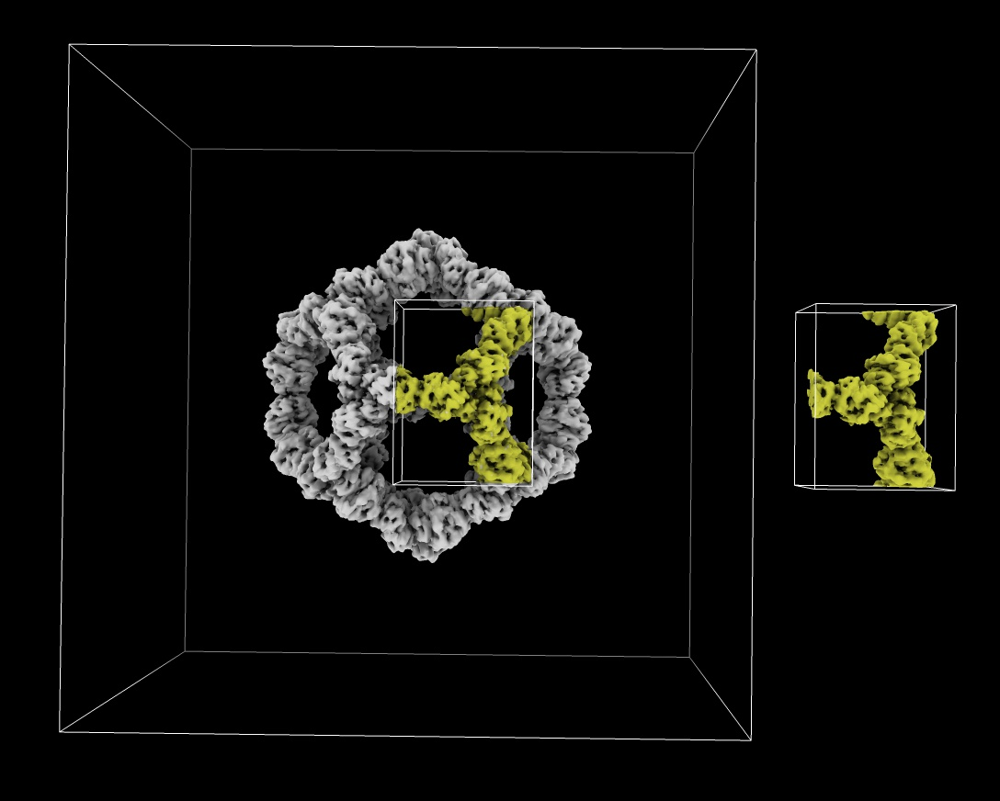

# Read an MRC map file and write out a subregion

ChimeraX can read [MRC map files](https://www.ccpem.ac.uk/mrc_format/mrc_format.php)
often used for electron microscopy and x-ray crystallography.
Here is how to read an MRC file fetched from the EM Databank and write out a subregion
(grid points 130-190 in x, 100-180 in y, 160-220 in z) as another MRC file using ChimeraX commands

    open 11997 from emdb
    volume #1 region 130,100,160,190,180,220
    save ~/Desktop/subregion.mrc

And here is how to read and write a subregion using Python code [read_mrc.py](read_mrc.py):

    #
    # Read an MRC file and save a subbox region as another MRC file.
    #
    from chimerax.map_data import mrc, GridSubregion
    g = mrc.open('/Users/goddard/Downloads/ChimeraX/EMDB/emd_11997.map')[0]
    gbox = GridSubregion(g, ijk_min = (130,100,160), ijk_max = (190,180,220))
    mrc.save(gbox, '/Users/goddard/Desktop/subregion.mrc')

    # If you want to use the 3D numpy array for the subregion here is how to get it
    m = gbox.matrix()

Opening the data returns a [GridData](https://www.rbvi.ucsf.edu/chimerax/docs/devel/bundles/map/src/map.html#chimerax.map_data.GridData) Python object described in the [ChimeraX Programming Manual](https://www.rbvi.ucsf.edu/chimerax/docs/devel/index.html).

This example code does not create the [Volume](https://www.rbvi.ucsf.edu/chimerax/docs/devel/bundles/map/src/map.html#chimerax.map.Volume) rendering model so it will not display anything in ChimeraX.  The above code would be for data processing tasks rather than visualization. To render the model you would open the file in a different way and could access its grid as follows

    from chimerax.map import open_map
    models, message = open_map(session, '/Users/goddard/Downloads/ChimeraX/EMDB/emd_11997.map')
    session.models.add(models)
    v = models[0]	# Volume object
    g = v.data		# GridData object
     
Tom Goddard, May 21, 2021
