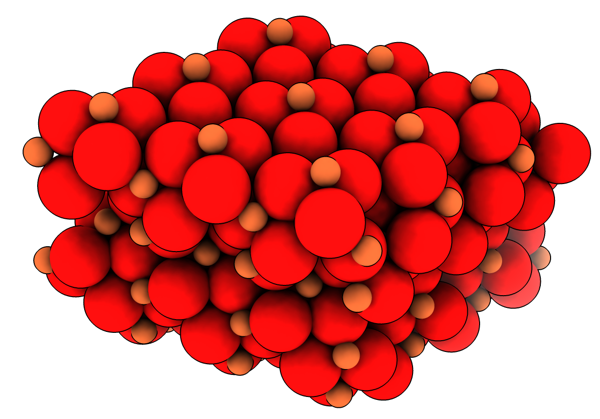

# Select overlapping atoms

Here is Python code defining a command "overlapped" that selects atoms that are on top of other atoms.  I was trying to make an iron-oxide crystal [hematite](https://virtual-museum.soils.wisc.edu/display/hematite/) from the unit cell and it produced many atoms exactly on top of each other.  The overlapped command let me select and delete the duplicate atoms.  The first copy of an atom at a position is not selected, but all other copies within 0.1 Angstroms are selected (use "distance" option to change tolerance).  Open the Python code to define the command

    open overlap.py

then use the command to select and remove the duplicate atoms from the crystal with asymmetric unit [hematite_asym_unit.cif](hematite_asym_unit.cif).

    open hematite_asym_unit.cif
    unitcell #1 cells 3,3,1
    combine #2 name hematite_crystal
    overlap #3
    delete sel

This doesn't create the correct bonds for the crystal.  We can add the bonds with the [connect command](../connect/connect.md) and save the result [hematite_crystal.mol2](hematite_crystal.mol2).

    ~bond #3
    connect #3
    save hematite_crystal.mol2 model #3

Here is the [overlap.py](overlap.py) code:

    #
    # Select atoms that overlap previous atoms within a specified distance.
    # Opening this Python defines the "overlapped" command.  Example use
    #
    #        overlap #1 distance 0.3
    #

    def overlapped_atoms(session, atoms, distance = 0.1):
        xyz = atoms.scene_coords
        from numpy import zeros
        dup = zeros((len(atoms),), bool)
        from chimerax.geometry import find_close_points
        for i,a in enumerate(atoms):
            if not dup[i]:
                i1, i2 = find_close_points([a.scene_coord], xyz, distance)
                dup[i2] = True
                dup[i] = False
        session.selection.clear()
        datoms = atoms[dup]
        datoms.selected = True
        n = len(datoms)
        session.logger.status(f'{n} overlapped atoms', log=True)
        return datoms

    def register_command(logger):
        from chimerax.core.commands import register, CmdDesc, FloatArg
        from chimerax.atomic import AtomsArg
        desc = CmdDesc(required = [('atoms', AtomsArg)],
                       keyword = [('distance', FloatArg)],
                       synopsis='Select overlapped atoms')
        register('overlapped', desc, overlapped_atoms, logger=logger)

    register_command(session.logger)

Tom Goddard, March 16, 2022
