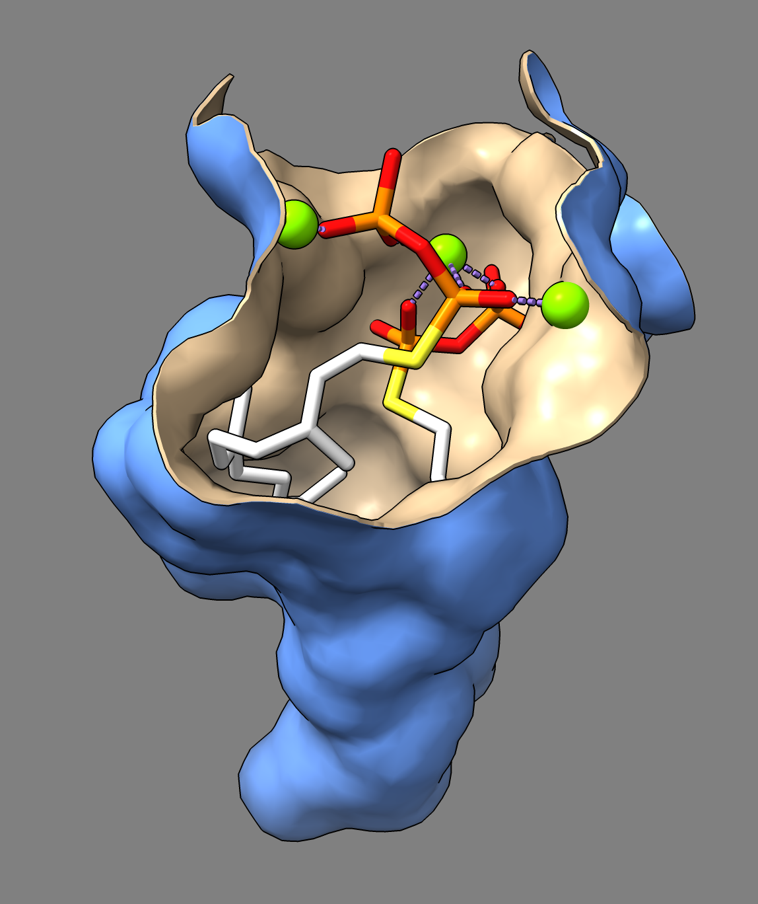

# Show a binding pocket surface

Here are commands that show the surface of a protein binding pocket.  This uses a fancy ChimeraX command [measure contactArea](https://www.cgl.ucsf.edu/chimerax/docs/user/commands/measure.html#contactarea) which shows the protein surface where it is within 3 Angstroms of the ligand surface.  This creates a fairly nice pocket surface without too many jagged edges.  The commands also make the surface have a small thickness and makes two copies of it so the inside and outside of the surface can be given different colors.  The example uses Protein Databank model PDB [2zcp](https://www.rcsb.org/structure/2zcp).

    open 2zcp
    delete /b
    surface :fps sharp false
    surface protein sharp false
    measure contactArea #1.3 with #1.2 distance 3 slab -.1,0 color tan
    measure contactArea #1.3 with #1.2 distance 2.99 slab -.11,-.01 color cornflowerblue
    surface close #1
    surface dust #2,3 size 1 metric "size rank"
    hide atoms,ribbon
    show #1:fps,mg
    color C white
    set bgcolor gray
    graphics silhouettes true
    view

Tom Goddard, April 3, 2024