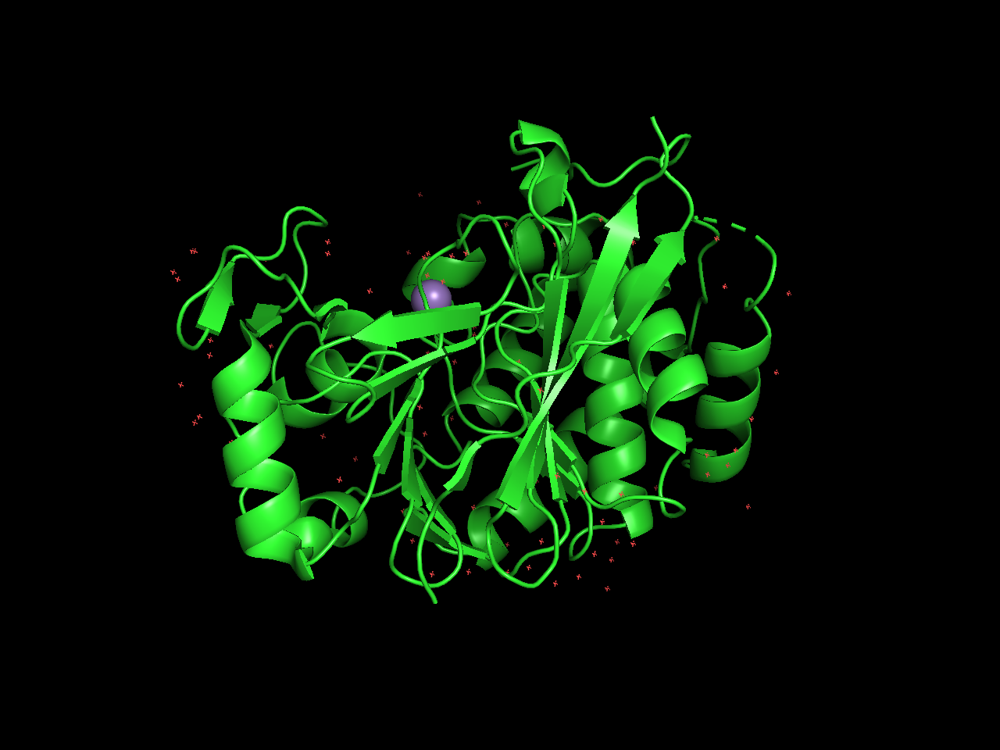
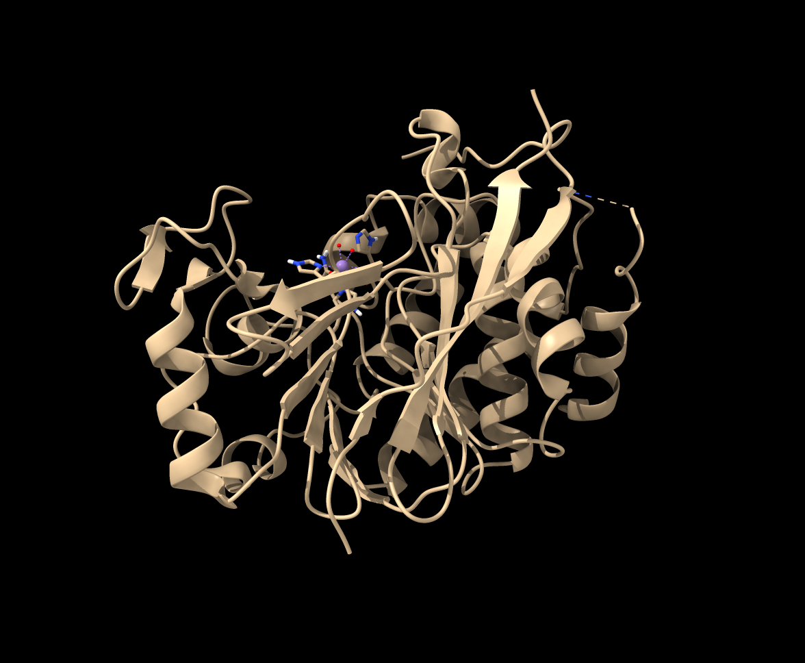

# Show PyMol view direction

Here is Python code defining a command "pymolview" that sets the camera view direction to match a view in PyMol using the parameters from the PyMol [cmd.get_view()](https://pymolwiki.org/index.php/Get_View) function. Open the Python code to define the command

    open pymol_view.py

then use the command to set the camera view using the 18 parameters reported by PyMol.

    open 4v0x
    pymolview 0.5338886380195618, 0.19662711024284363, 0.8223745822906494, 0.1919989138841629, 0.9189900159835815, -0.34437406063079834, -0.8234677910804749, 0.34175243973731995, 0.452885240316391, 0.0, 0.0, -177.17364501953125, -27.024879455566406, 14.224754333496094, -6.485495567321777, 139.68505859375, 214.6622314453125, -20.0

<table>
<tr>
<td></td>
<td></td>
</tr>
<tr>
<td align=center>PyMol</td>
<td align=center>ChimeraX</td>
</tr>
</table>

This command does not set the clip planes or orthographic projection although those could be easily added.

Here is the [pymol_view.py](pymol_view.py) code:

    #
    # Set the ChimeraX camera to match the view report by PyMol function cmd.get_view()
    #   https://pymolwiki.org/index.php/Get_View
    #
    # Open this Python code to define the ChimeraX pymolview command
    # 
    #   open pymol_view.py
    #   pymolview 0.5338886380195618, 0.19662711024284363, 0.8223745822906494, 0.1919989138841629, 0.9189900159835815, -0.34437406063079834, -0.8234677910804749, 0.34175243973731995, 0.452885240316391, 0.0, 0.0, -177.17364501953125, -27.024879455566406, 14.224754333496094, -6.485495567321777, 139.68505859375, 214.6622314453125, -20.0
    # 
    #
    def pymol_view(session, parameters):
        view = [float(p) for p in parameters.split(',')]
        r0,r1,r2 = view[:3], view[3:6], view[6:9]   # rotate model to camera
        cam_origin = view[9:12]                        # rotation origin in camera coords
        model_origin = view[12:15]                        # rotation origin in model coords.
        near_clip, far_clip = view[15:17]
        ortho_flag = view[17]
        from chimerax.geometry import Place, translation
        scene_to_camera = (translation(cam_origin) *
                           Place(axes = (r0,r1,r2)) *
                           translation([-x for x in model_origin]))
        camera_to_scene = scene_to_camera.inverse()
        camera = session.main_view.camera
        camera.position = camera_to_scene

    def register_command(logger):
        from chimerax.core.commands import register, CmdDesc, RestOfLine
        desc = CmdDesc(required = [('parameters', RestOfLine)],
                       synopsis='Set camera view direction to match PyMol')
        register('pymolview', desc, pymol_view, logger=logger)

    register_command(session.logger)

Tom Goddard, June 24, 2022
