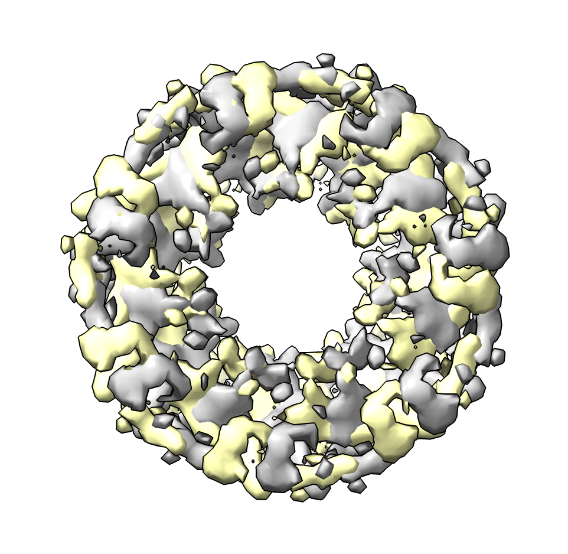

# Rotate a map by 90 degees about z axis

Here we add a "volume rotate90" command to rotate a map by 90 degrees about the z axis.  This makes the x-axis become the y-axis and the y-axis become the negative x-axis.  This allows saving the map with the axes rotated.  If you instead just rotate the map in the ChimeraX graphics it does not change the 3D data array and the rotation will not be saved in a new map file.  Leonardo Talachia Rosa [asked](https://www.rbvi.ucsf.edu/pipermail/chimera-users/2023-January/019028.html) about this to reorient a map with 5-fold dihedral symmetry for use by external analysis software.

To define the new command in ChimeraX open the [rotate_90.py](rotate_90.py) Python code.

    open rotate_90.py

Then open a map and apply the command

    open 1080 from emdb
    volume rotate90 #1
    save 1080_rotated.mrc model #2

The rotation command makes a copy of the map.

Here is the [rotate_90.py](rotate_90.py) code, for ChimeraX 1.4 or newer.

    # Create command "volume rotate90" to rotate a map 90 degrees about z.
    #
    #  volume rotate90 #1

    def volume_rotate90(session, volume):
        # Swap x and y axes then flip sign of x axis.
        m = volume.full_matrix().transpose((0,2,1))[:,:,::-1].copy()
        from chimerax.map_data import ArrayGridData
        ox,oy,oz = volume.data.origin
        sx,sy,sz = volume.data.step
        grid = ArrayGridData(m, origin = (oy,ox,oz), step = (sy,sx,sz),
                                 name = volume.name + 'rotate 90')
        from chimerax.map import volume_from_grid_data
        v = volume_from_grid_data(grid, session)
        return v

    def register_command(session):
        from chimerax.core.commands import CmdDesc, register
        from chimerax.map import MapArg
        desc = CmdDesc(required=[('volume', MapArg)],
                       synopsis='Rotate map 90 degrees about z axis')
        register('volume rotate90', desc, volume_rotate90, logger=session.logger)

    register_command(session)

Tom Goddard, January 25, 2023
