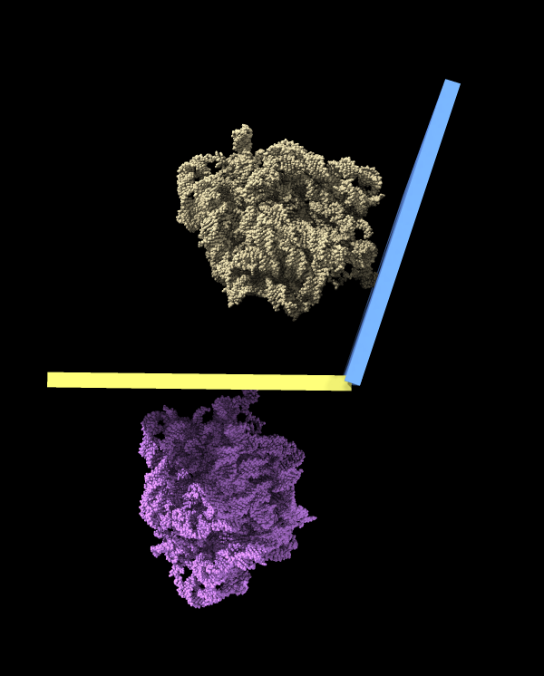

# Depict monomer rotation in a dimer using slabs

Given two touching ribosomes observed in cryoET data Andrea Dallape wanted to show the rotation of one to the other.  The measure rotation command to do that.  Open two copies of the structure, then move one copy to align a monomer in one copy with the alternate monomer in the other copy.  This example matches the two 25S rRNA (chains Aa and 1b) of PDB 6t83.  I deleted the other chains to make the image simpler.

    open 6t83
    open 6t83
    mm #2/Aa to #1/1b pairing ss matrix nucleic
    measure rotation #2 to #1 showslabs true
    delete ~/Aa,1b
    hide #2 model

Here is what this produces:

Tom Goddard, December 18, 2020