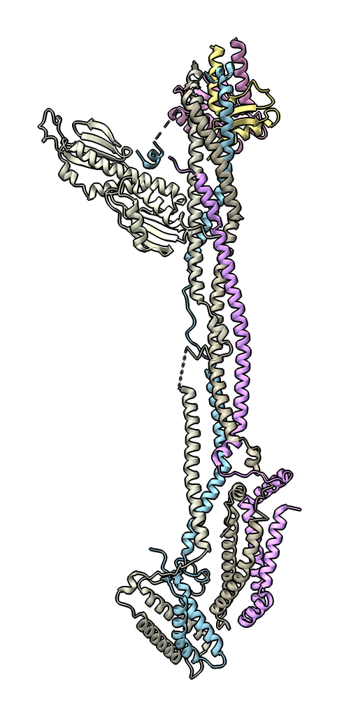

# Show residue-residue distance heatmap

Here is Python code defining a command "rrdist" that computes the distances between C-alpha atoms for all pairs of protein residues in a structure and plots them as a heatmap.  The Chimera [RR Distance Maps](https://www.cgl.ucsf.edu/chimera/docs/ContributedSoftware/rrdistmaps/rrdistmaps.html) tool does this, but there is no equivalent tool in ChimeraX.  To plot the distances in ChimeraX this Python uses the AlphaFold PAE plot.  The distances are written to a text JSON file in the AlphaFold PAE format.  Pablo Herrera Nieta [asked](https://mail.cgl.ucsf.edu/mailman/archives/list/chimerax-users@cgl.ucsf.edu/thread/56YWK5QPB7O4W2TFV2NRO63HU5G7JJTW/) about this on the ChimeraX mailing list.

To define the rrdist command open [rrdist.py](rrdist.py) in ChimeraX

    open rrdist.py

then open a structure and use the rrdist command on it specifying a file path for the json file and the plot will be shown.

    open 8q5h
    rrdist #1 dist.json
    

The black lines in the plot separate the chains (7 in the example shown), and the first to last residues run from the upper left corner of the plot down the vertical axis and to the right across the horizontal axis.  Dragging the mouse on the plot colors ribbon residues (not atoms).  See the ChimeraX [AlphaFold PAE plot documentation](https://www.rbvi.ucsf.edu/chimerax/docs/user/tools/alphafold.html#pae) for an explanation.  You may want to delete not protein chains before running rrdist using

    delete ~protein

The Chimera RR Distance Map tool allowed analyzing ensembles of structures to see which distances have changed.  This code could be modified to show distance differences, but developing a full tool as in Chimera to explore these distance plots would take a lot of work.

Here is the [rrdist.py](rrdist.py) code:

    # Compute all pairwise distances between residues and write to a JSON file in AlphaFold PAE
    # format so that the distance map can be displayed as a 2D plot with menu entry
    # Tools / Structure Prediction / AlphaFold Error Plot.

    def rr_distance_map(session, structure, json_output_path):
        residues = structure.residues

        # Choose atom for each residue to measure distances
        atoms = []
        for r in residues:
            a = r.principal_atom
            if a is None:
                # Use the first atom if no principal atom.
                # The distance matrix must have the same size as the number of residues
                # in the structure for the AlphaFold PAE plot to work.
                a = r.atoms[0]
            atoms.append(a)

        # Compute distance matrix
        from chimerax.atomic import Atoms
        xyz = Atoms(atoms).scene_coords
        n = len(xyz)
        from numpy import empty, float32, sqrt
        dist = empty((n,n), float32)
        for i in range(n):
            row = xyz - xyz[i]
            dist[i,:] = sqrt((row*row).sum(axis = 1))

        # Write matrix in JSON AlphaFold PAE format
        # {"pae": [[17.14, 18.75, 17.91, ...], [5.32, 8.23, ...], ... ]}
        dists = ', '.join(('[ ' + ', '.join('%.2f' % dist[i,j] for j in range(n)) + ' ]')
                          for i in range(n))
        with open(json_output_path, 'w') as file:
            file.write('{"pae": [')
            file.write(dists)
            file.write(']}')

        # Open PAE plot
        from chimerax.core.commands import run, quote_if_necessary
        open_cmd = f'alphafold pae #{structure.id_string} file {quote_if_necessary(json_output_path)}'
        run(session, open_cmd)

    def register_command(logger):
        from chimerax.core.commands import CmdDesc, register, SaveFileNameArg
        from chimerax.atomic import StructureArg
        desc = CmdDesc(
            required = [('structure', StructureArg),
                        ('json_output_path', SaveFileNameArg)],
            synopsis = 'Compute residue-residue distance map and show with AlphaFold PAE plot'
        )
        register('rrdist', desc, rr_distance_map, logger=logger)

    register_command(session.logger)

Tom Goddard, March 5, 2024
