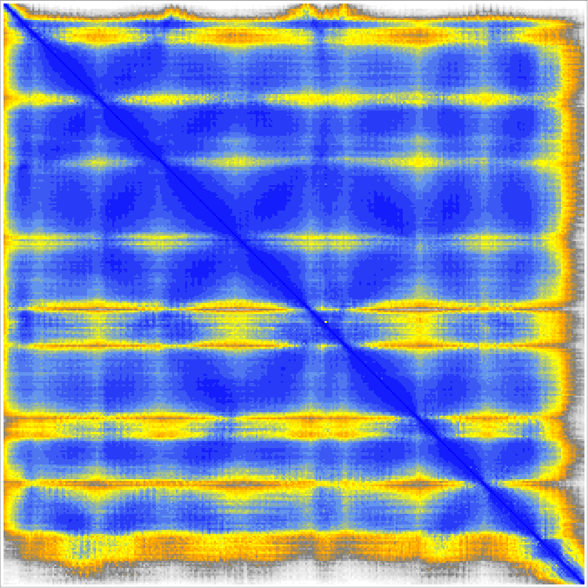

# Save an image of an AlphaFold predicted aligned error plot

There is a "Save image" menu entry on ChimeraX PAE plots but there is no equivalent command to save that image.  James Proctor [asked](https://mail.cgl.ucsf.edu/mailman/archives/list/chimerax-users@cgl.ucsf.edu/thread/VFYZHLW4HXKCVAMZ3AZKW2TUZ72KSVRR/) for a command so he can script saving 1000 images.  Here is some Python code [savepaeplot.py](savepaeplot.py) that defines a savepaeplot command.  Open this file in ChimeraX to define the command, and open an AlphaFold predicted structure and PAE plot and then save the image.  Here is an example

    open savepaeplot.py
    open Q9H255 from alphafold
    alphafold pae #1 uniprotId Q9H255
    savepaeplot #1 Q9H255_pae.png

Here is the [savepaeplot.py](savepaeplot.py) code:

    def save_pae_plot(session, structure, path):
        from chimerax.alphafold.pae import AlphaFoldPAEPlot
        for tool in session.tools.list():
            if isinstance(tool, AlphaFoldPAEPlot) and tool._pae.structure is structure:
                tool._pae_view.save_image(path)

    def register_command(logger):
        from chimerax.core.commands import CmdDesc, register, SaveFileNameArg
        from chimerax.atomic import StructureArg
        desc = CmdDesc(
            required = [('structure', StructureArg),
                        ('path', SaveFileNameArg)],
            synopsis = 'Save an image of a PAE plot'
        )
        register('savepaeplot', desc, save_pae_plot, logger=logger)

    register_command(session.logger)    

Tom Goddard, April 14, 2025
