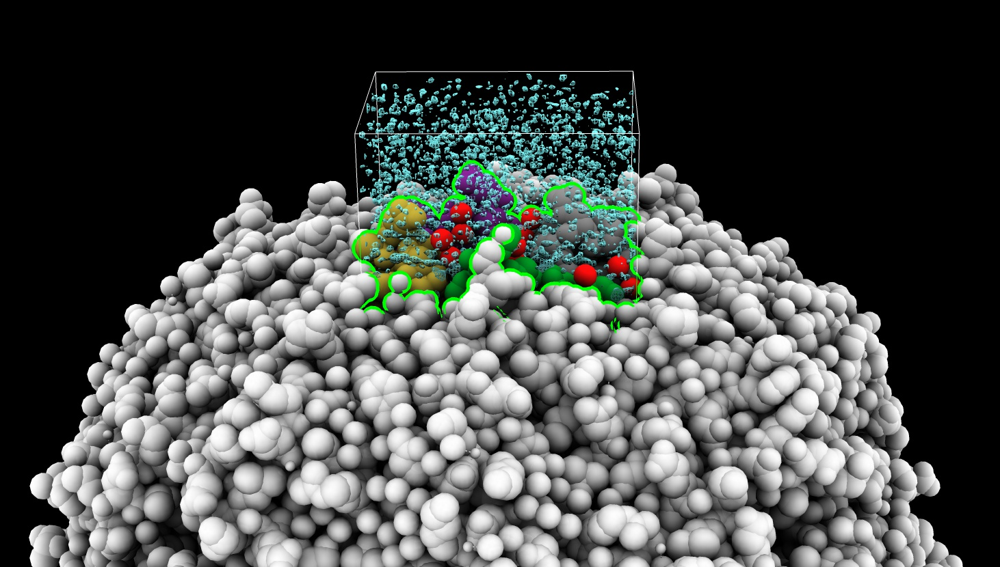

# Select atoms inside map bounds

Here is Python code to select atoms within the bounds of a displayed map subregion.

    open 7k3v
    open 22657 from emdb
    volume #2 region 184,164,261,246,247,396

    open selectbox.py
    selectbox #1 inMap #2

Here is the [select_box.py](select_box.py) code that defines the selectbox command:

    #
    # Implement selectbox command that selects atoms within the bounds of shown map subregion.
    #
    #   open select_box.py
    #   selectbox #1 in #2
    #
    def select_box(session, atoms, in_map):

        # First convert atom coordinates to map coordinates in case
        # one has been moved relative to the other.
        pos = in_map.position.inverse().transform_points(atoms.scene_coords)
        x,y,z = pos[:,0], pos[:,1], pos[:,2]

        # Find atoms with coordinates in map bounds
        (xmin,ymin,zmin), (xmax,ymax,zmax) = in_map.xyz_bounds()
        mask = (x >= xmin) & (x <= xmax) & (y >= ymin) & (y <= ymax) & (z >= zmin) & (z <= zmax)
        inside_atoms = atoms[mask]

        # Select inside atoms
        session.selection.clear()
        inside_atoms.selected = True
        inside_atoms.intra_bonds.selected = True

        # Log a message saying how many atoms selected.
        session.logger.status('Selected %d atoms in map %s bounds'
                              % (len(inside_atoms), in_map.name_with_id()),
                              log = True)
        return inside_atoms

    def register_selectbox_command(logger):
        from chimerax.core.commands import CmdDesc, register
        from chimerax.atomic import AtomsArg
        from chimerax.map import MapArg
        desc = CmdDesc(
            required = [('atoms', AtomsArg)],
            keyword = [('in_map', MapArg)],
            required_arguments = ['in_map'],
            synopsis = 'Select atoms in shown map subregion'
        )
        register('selectbox', desc, select_box, logger=logger)

    register_selectbox_command(session.logger)

Tom Goddard, February 2, 2021
