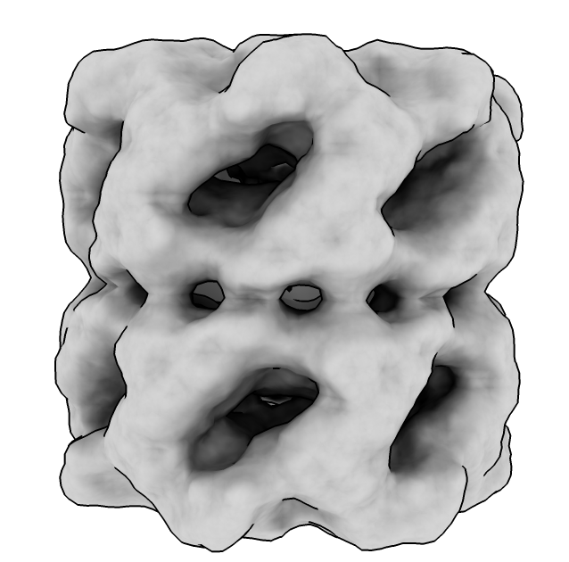
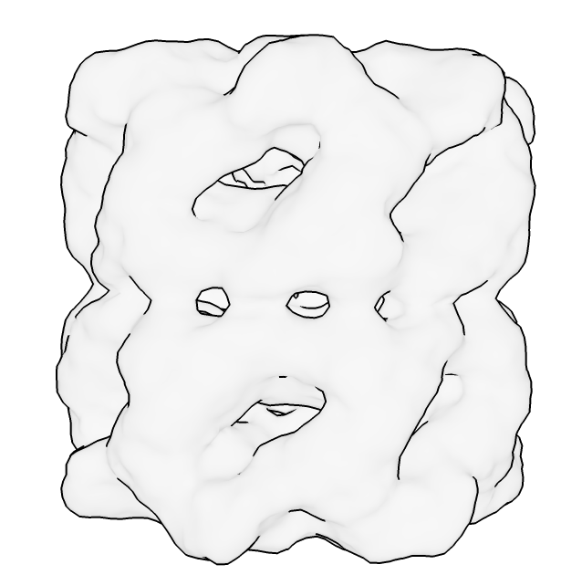
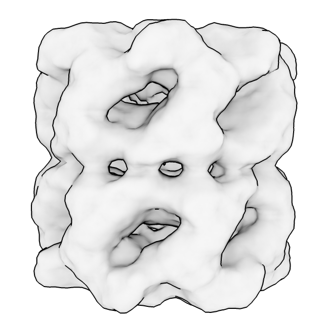
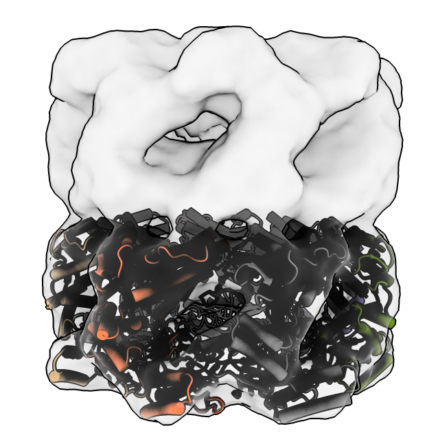
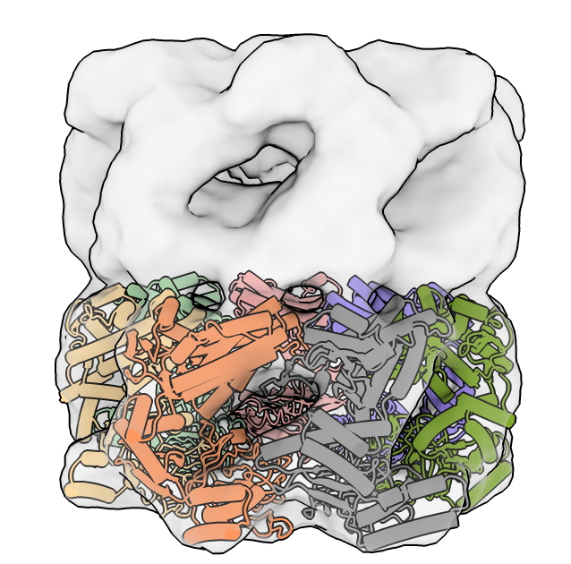
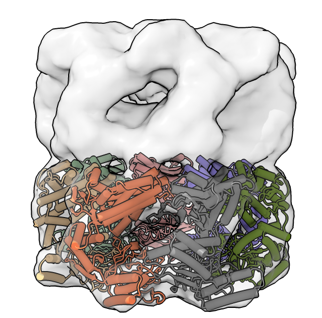

# Show shadows with a transparent surface

Here is how to use "soft" lighting, ie shadows cast from all directions, with a transparent surface.  Scott Stagg [asked](https://www.rbvi.ucsf.edu/pipermail/chimerax-users/2023-February/004936.html) how to do this.  There is some obscure ChimeraX magic involved.  If you use the "soft" lighting (shadows cast from all directions) with a transparent surface it looks horrible because transparent surfaces by default don't cast shadows in ChimeraX.  The reason for that default is often you are showing a molecule inside a transparent surface and then the molecule is dark (black actually) and hard to see.  Because the transparent surface doesn't cast shadows it does not shadow itself so you don't get any of the darkened cavities that help 3D appearance.  To make transparent surface cast shadows use ChimeraX command

    material transparentCastShadows true

If you have an atomic structure (#2) inside the surface it will look black (shadowed), but you can tell it not to accept shadows

    lighting model #2 multishadow false

The model inside can look pretty horrible and flat with soft lighting and you might try full lighting that adds a spot light, and also use silhouette edges.

Here is an example of all these tricks.

    open 1080 from emdb
    light soft
    volume level 0.6
    open 1grl
    preset cylinders
    fitmap #2 in #1
    transparency #1 80
    material transparentCastShadows true
    lighting model #2 multishadow false
    graphics silhouettes true
    set bgColor white
    light full

<table>
<tr>
<td> Opaque surface soft lighting.</td>
<td> Transparent surface.</td>
<td> Transparent surface casting shadows.</td>
</tr>
<tr>
<td> Atomic model dark.</td>
<td> Atomic model without shadows.</td>
<td> Full lighting.</td>
</tr>
</table>

Tom Goddard, February 10, 2023