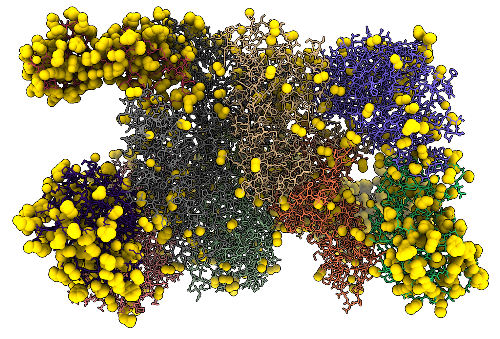
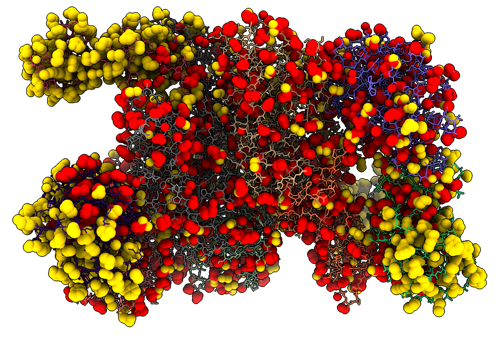

# Complete sidechains by replacing all of them with swapaa

Suppose you have a protein atomic model with parts of some side chains missing.  This is common at lower resolutions in Protein Data Bank models.  How can I make a model with complete side chains?  Here is a bad way to do it.  We will replace every sidechain with the ChimeraX [swapaa](https://www.rbvi.ucsf.edu/chimerax/docs/user/commands/swapaa.html) command.  That command is usually used to mutate a residue, changing its amino acid type.  But if it is used to replace a side chain with the same amino acid it will create a complete side chain.  The main problem is that it deletes the previous side chain, so all its atom positions are lost.  Then it adds the new side chain using atom positions from a rotamer library, choosing a rotamer that reduces clashes, increases hydrogen bonds, or maximizes atom density values of a cryoEM or X-ray map.

The code [rebuild_sidechains.py](rebuild_sidechains.py) adds a command rebuildsidechains that runs swapaa on every specified residue.

We will try it on PDB 6o9z of eurkaryotic translation initiation factors solved by cryoEM at 3 Angstroms resolution because Adam Frost and Rebecca Divarco asked about completing side chains and this structure was solved in Adam's lab

   open 6o9z
   open rebuild_sidechains.py
   rebuild #1

This took 2500 seconds to run to replace 3600 side chains, or about 0.7 seconds per residue.  It is slow because it is checking for hydrogen bonds for each sidechain position from a large rotamer library.  Four errors are reported, two SEP residues are not in the Dunbrack rotamer library, and two GLY residues (/G:44 and /H:44) failed due to a bug in swapaa that happens when the carboxyl oxygen is missing on the backbone.  Why that oxygen is missing in these two residues is unknown -- possibly a mistake in the structure.

I wanted to see which atoms this added, so I wrote another bit of Python [added_atoms.py](added_atoms.py) that creates the addedatoms command that selects the atoms in one structure that are not in the other.  We open the original 6o9z to compare to the modified one.

    open 6o9z
    open added_atoms.py
    added #2 to #1

which selects 2630 atoms that have been added.  Here I colored the atoms gold and show them in sphere style.

We can also check if any atoms got deleted using added with the to models swapped:

    added #1 to #2

which reports none were deleted.

I was curious how many atoms in the rebuilt side chains were moved far from their original positions.  So I wrote a third bit of Python [atom_motion.py](atom_motion.py) that assigns an attribute named "motion" to each atom that is paired between two structures.  The motion value is the distance between the two atoms.  Then I can select atoms that have moved by more than 2 Angstroms.

    open atom_motion.py
    atommotion #2 to #1
    select #1 @@motion>2

which shows 2458 atoms have been moved by more than 2 Angstroms.  I show those moved atoms as red spheres.

If you open the EMDB map that was used to solve this structure

   open 0664 from emdb

and rerun the rebuilding of side chains the swapaa command will see there is a density map open and instead place side chains to maximize the total density value at the atom positions as described in the swapaa [documentation](https://www.rbvi.ucsf.edu/chimerax/docs/user/commands/swapaa.html).  This produces a much worse result with more large motions and many clashes.

Here is the [rebuild_sidechains.py](rebuild_sidechains.py) code:

    # Run swapaa on every residue for each displayed atomic structure.
    # This replaces all side chains and is intended to complete the side chains.

    def rebuild_sidechains(session, residues):
	'''
	Runs swapaa on each residue to replace the side chain with same amino acid
	in order to complete the side chains.
	'''
	from chimerax.core.commands import run
	from chimerax.core.errors import UserError, LimitationError
	errors = []
	for i,r in enumerate(residues):
	    if 'CA' in r.atoms.names:
		command = 'swapaa %s %s log false' % (r.string(style = 'command'), r.name)
		try:
		    run(session, command, log = False)
		except (UserError, LimitationError) as e:
		    errors.append(str(e))
		session.logger.status('Completed %d of %d residues' % (i+1, len(residues)),
				      secondary = True)
	if errors:
	    msg = '\n'.join(errors)
	    session.logger.warning(msg)

    def register_command(session):
	from chimerax.core.commands import CmdDesc, register
	from chimerax.atomic import ResiduesArg
	desc = CmdDesc(required=[('residues', ResiduesArg)],
		       synopsis='Replace side chains to complete side chain atoms')
	register('rebuildsidechains', desc, rebuild_sidechains, logger=session.logger)

    register_command(session)

Here is the [added_atoms.py](added_atoms.py) code:

    def added_atoms(session, atoms, to_atoms):
	amap = {(a.residue.chain_id, a.residue.number, a.name):a for a in atoms}
	from chimerax.atomic import Atoms
	added = Atoms([a for a in to_atoms
		       if (a.residue.chain_id, a.residue.number, a.name) not in amap])
	session.selection.clear()
	added.selected = True
	session.logger.status('Added %d atoms' % len(added), log = True)
	return added

    def register_command(session):
	from chimerax.core.commands import CmdDesc, register
	from chimerax.atomic import AtomsArg
	desc = CmdDesc(required=[('atoms', AtomsArg)],
		       keyword=[('to_atoms', AtomsArg)],
		       required_arguments = ['to_atoms'],
		       synopsis='Select atoms in second set that are not in first set.')
	register('addedatoms', desc, added_atoms, logger=session.logger)

    register_command(session)

Here is the [atom_motion.py](atom_motion.py) code:

    def atom_motion(session, atoms, to_atoms):
	amap = {(a.residue.chain_id, a.residue.number, a.name):a for a in atoms}
	count = 0
	from chimerax.geometry import distance
	for a in to_atoms:
	    a2 = amap.get((a.residue.chain_id, a.residue.number, a.name))
	    if a2:
		d = distance(a.scene_coord, a2.scene_coord)
		a2.motion = a.motion = d
		count += 1
	session.logger.status('%d atom pairs' % count, log = True)

    def register_command(session):
	from chimerax.core.commands import CmdDesc, register
	from chimerax.atomic import AtomsArg
	desc = CmdDesc(required=[('atoms', AtomsArg)],
		       keyword=[('to_atoms', AtomsArg)],
		       required_arguments = ['to_atoms'],
		       synopsis='Set motion atom attribute to distance between corresponding atoms.')
	register('atommotion', desc, atom_motion, logger=session.logger)

    register_command(session)

Tom Goddard, June 10, 2021
