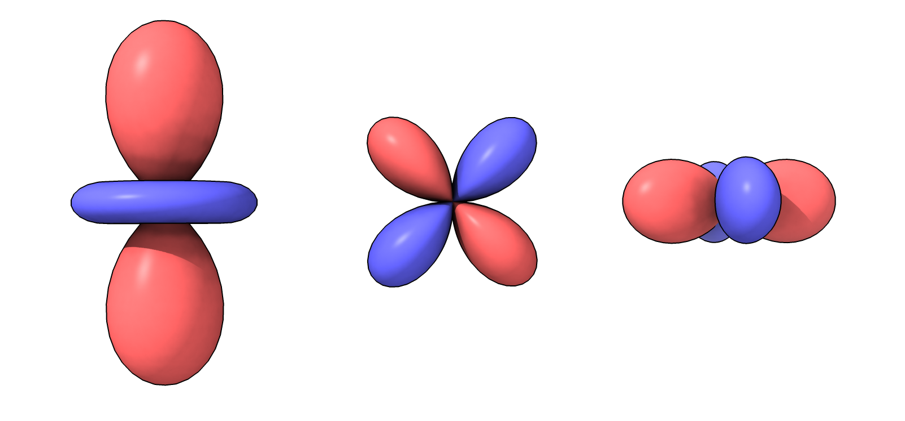
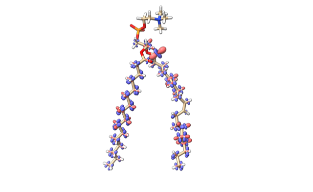

# Making a Spherical Harmonic Surface

Here is some Python code when opened in ChimeraX creates spherical harmonic surfaces.  Albert Smith [asked](http://plato.cgl.ucsf.edu/pipermail/chimera-users/2020-August/017135.html) about this.  The real part of the spherical harmonic is depicted as the surface radius and colored red for positive radius and blue for negative radius.

    r = Ylm(theta, phi)

where Ylm is a spherical harmonic, l = 2, m=0,1,2.

Python code [ylm.py](ylm.py) for ChimeraX 1.0:

<pre>
# Make a spherical harmonic surface.

from math import sin, cos, pi, sqrt

def spherical_surface(session,
                      radius_function,
                      move = None,	# a Place instance to rotate and translate surface
                      theta_steps = 100,
                      phi_steps = 50,
                      positive_color = (255,100,100,255), # red, green, blue, alpha, 0-255 
                      negative_color = (100,100,255,255)):

    # Compute vertices and vertex colors
    vertices = []
    colors = []
    for t in range(theta_steps):
        theta = (t/theta_steps) * 2*pi
        ct, st = cos(theta), sin(theta)
        for p in range(phi_steps):
            phi = (p/(phi_steps-1)) * pi
            cp, sp = cos(phi), sin(phi)
            r = radius_function(theta, phi)
            xyz = (r*sp*ct, r*sp*st, r*cp)
            vertices.append(xyz)
            color = positive_color if r >= 0 else negative_color
            colors.append(color)

    # Compute triangles, triples of vertex indices
    triangles = []
    for t in range(theta_steps):
        for p in range(phi_steps-1):
            i = t*phi_steps + p
            t1 = (t+1)%theta_steps
            i1 = t1*phi_steps + p
            triangles.append((i,i+1,i1+1))
            triangles.append((i,i1+1,i1))

    # Create numpy arrays
    from numpy import array, float32, uint8, int32
    va = array(vertices, float32)
    ca = array(colors, uint8)
    ta = array(triangles, int32)

    # Rotate and translate vertices to a new location.
    if move is not None:
        move.transform_points(va, in_place = True)
        
    # Compute average vertex normal vectors
    from chimerax.surface import calculate_vertex_normals
    na = calculate_vertex_normals(va, ta)

    # Create ChimeraX surface model
    from chimerax.core.models import Surface
    s = Surface('surface', session)
    s.set_geometry(va, na, ta)
    s.vertex_colors = ca
    session.models.add([s])

    return s

# Example spherical harmonic function Y(l=2,m=0) real part.
def y20_re(theta, phi):
    return 0.25*sqrt(5/pi) * (3*cos(phi)**2 - 1)
def y21_re(theta, phi):
    return -0.5*sqrt(15/(2*pi)) * sin(phi)*cos(phi) * cos(theta)
def y22_re(theta, phi):
    return 0.25*sqrt(15/(2*pi)) * sin(phi)**2 * cos(2*theta)

from chimerax.geometry import translation

# Create 3 surfaces
spherical_surface(session, y20_re)
spherical_surface(session, y21_re, move = translation((1,0,0)) )
spherical_surface(session, y22_re, move = translation((2,0,0)) )
</pre>

## Combining surfaces into a single model

The above code could be modified to place several spherical harmonic surfaces in one model.  The vertices, normals, triangles and colors for each surface can be combined into one with

    geom = [(va1,na1,ta1,ca1), (va2,na2,ta2,ca2), ...]
    from chimerax.surface import combine_geometry_vntc
    va,na,ta,ca = combine_geometry_vntc(geom)

## NMR dipole couplings

Albert Smith-Penzel used display of spherical harmonic surfaces to show NMR dipole-dipole interactions between bonded H and C atoms.

Tom Goddard, August 28, 2020
