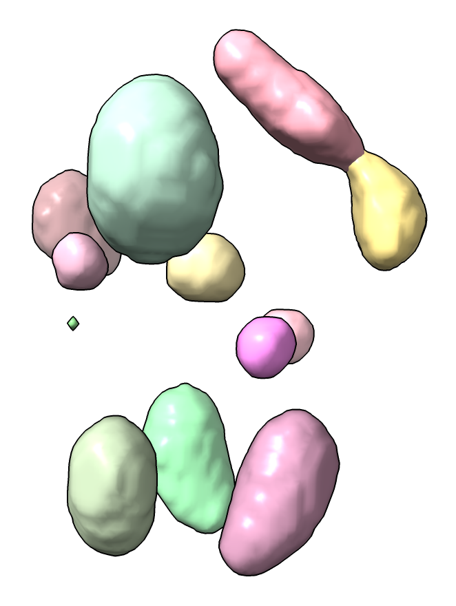
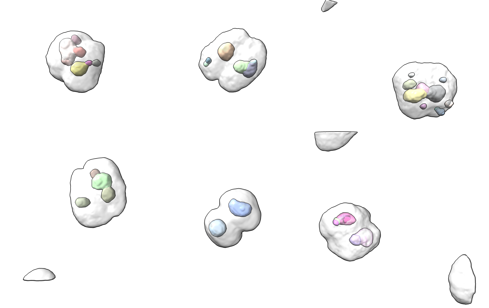

# Quantify spots in 3D microscopy

This code adds a command to identify spots in 3D microscopy data and report their intensity, volume, and position.  It identifies the spots and quantifies them using the Segger tool in ChimeraX (menu Tools / Volume Data / Segment Map).  That graphical user interface has no equivalent command, so the Python code below calls Segger to find the spots, then writes out comma-separated-values describing each spot.

Here is an example use

    open 34550 from emdb
    open spots.py
    spots #1 threshold 10

with output of 13 spots that looks like

<pre>
# Spot number, total intensity, mean intensity, max intensity, number of grid points, max x position, max y position, max z position
1,74.217,0.057712,0.076549,1286,86,70,84
2,62.173,0.053643,0.065282,1159,84,97,120
3,55.886,0.053174,0.0648,1051,105,105,118
...
</pre>

This code was developed for Charles Arthur at UC San Francisco to look at foci of fluorescently labeled molecules in 3D light microscopy of hundreds of cells.  Here is how to apply it to many maps in the same directory, writing a CSV file of spot data and an image for each map with file names matching the map file with suffixes .csv and .png.  It uses the ChimeraX open command [forEachFile](https://www.rbvi.ucsf.edu/chimerax/docs/user/commands/open.html#foreachfile) option to run a set of ChimeraX commands after opening each file.

    open spots.cxc forEachFile cell_*.tif

The microscopy image files are cell_*.tif and each has 4 channels (model numbers #1.1, #1.2, #1.3, #1.4) and we find spots in the second channel and make an image showing the first channel which is the cell membrane.  The [spots.cxc](spots.cxc) file is the following ChimeraX command file that will be executed for each image.

    spots #1.2 threshold 10 out "$file.csv"
    # Save an image with the membrane
    volume #1.1 style surface color lightgray transparency 0.8
    hide #1.2-4 model
    view
    save "$file.png"

The cell images look like

Here is the [spots.py](spots.py) code that defines the spots command

    # --------------------------------------------------------------------------------------
    # Adds ChimeraX "spots" command to run Segger on a map to segment spots above a given
    # threshold and output intensity, volume and position as comma-separated-values.
    # This was written to segment puncta in 3D light-microscopy for Arthur Charles at UCSF.
    # Example command
    #
    #     spots #1.2 threshold 10 output spots.csv
    #
    def spots(session, map, threshold_sdev = None, output_csv = None, smoothing_steps = 0):
	'''Segment light microscopy to quantify spots, report intensities.'''

	# Show map in surface style at desired threshold level at full resolution
	map.set_parameters(style = 'surface', step = 1)

	# Use threshold level of mean plus some number of standard deviations
	if threshold_sdev is not None:
	    # Compute mean and standard deviation
	    mean, sd = map_mean_and_sd(map)
	    threshold = mean + threshold_sdev * sd
	    map.set_parameters(surface_levels = [threshold])
	elif len(map.surfaces) == 0:
	    map.update_drawings()	# Set initial threshold level

	# Run Segger watershed segmentation
	spots = segment_spots(map, smoothing_steps)

	# Log comma-separated values file of spots.
	lines = ['# Spot number, total intensity, mean intensity, max intensity, number of grid points, max x position, max y position, max z position']
	for i,spot in enumerate(spots):
	    lines.append(str(i+1) + ',%.5g,%.5g,%.5g,%d,%d,%d,%d' % spot)
	results = '\n'.join(lines) + '\n'
	session.logger.info(results)

	if output_csv:
	    with open(output_csv, 'w') as file:
		file.write(results)

    def segment_spots(map, smoothing_steps = 0):
	'''
	ChimeraX does not have a command to run the Segger segmentation so do it with Python.
	'''
	from chimerax.segger import segment_dialog
	d = segment_dialog.volume_segmentation_dialog(session, create=True)
	d._map_menu.value = map
	d._num_steps.value = smoothing_steps
	d.cur_seg = None				# Don't reuse previous segmentation
	segmentation = d.Segment()

	# Put segmentation at same level as map for convenience when
	# showing multiple data sets.
	if segmentation.parent is not map.parent:
	    session.models.add([segmentation], parent = map.parent)

	# Quantify each region.
	spots = []
	for region in segmentation.regions:
	    ijk = region.points()
	    num_grid_points = len(ijk)
	    im,jm,km = region.max_point
	    m = map.matrix(step = 1)
	    from numpy import float64
	    mean = m.mean(dtype=float64)
	    map_values = m[ijk[:,2],ijk[:,1],ijk[:,0]]
	    total_intensity = map_values.sum() - num_grid_points * mean
	    mean_intensity = map_values.mean(dtype=float64) - mean
	    max_intensity = m[km,jm,im] - mean
	    spots.append((total_intensity, mean_intensity, max_intensity, num_grid_points, im, jm, km))

	# Sort from largest to smallest intensity.
	spots.sort(reverse = True)

	return spots

    def map_mean_and_sd(map):
	m = map.matrix(step = 1)
	from numpy import float64
	mean = m.mean(dtype=float64)
	sd = m.std(dtype=float64)
	return mean, sd

    def register_command(session):
	from chimerax.core.commands import CmdDesc, register, FloatArg, SaveFileNameArg, IntArg
	from chimerax.map import MapArg
	desc = CmdDesc(required= [('map', MapArg)],
		       keyword = [('threshold_sdev', FloatArg),
				  ('output_csv', SaveFileNameArg),
				  ('smoothing_steps', IntArg)],
		       synopsis = 'quantify spots in volume data')
	register('spots', desc, spots, logger=session.logger)

    register_command(session)

Tom Goddard, November 6, 2023
