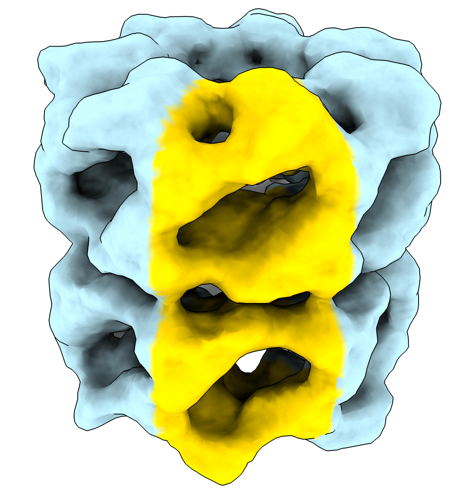

# Color each vertex of a surface using a value from a file

Here is some ChimeraX Python code that colors a surface using a numeric value for each vertex read from a file.  Each line of the file has one floating point number with as many lines as there are surface vertices.  These vertex values would come from custom surface analysis code.

Opening the Python code [surface_color.py](surface_color.py) defines the surfcolor command.

    open surface_color.py

Here are commands to color a surface [example_surface.stl](example_surface.stl) using [vertex_values.txt](vertex_values.txt).  The vertex value in this example is the polar angle from -180 to 180 degrees.

    cd ~/Downloads
    open example_surface.stl
    surfcolor #1 values vertex_values.txt palette -180,lightblue:128.5,lightblue:128.6,gold

Here is the Python code

<pre>
    def surfcolor(session, surface, values_file, palette = None):
        '''
        Color surface using vertex values read from a file.
        '''
        with open(values_file, 'r') as f:
            values = [float(line) for line in f.readlines() if line.strip() != '']
        if len(values) != len(surface.vertices):
            raise ValueError(f'File {values_file} has {len(values)} values which does not match '
                             f'the number of vertices ({len(surface.vertices)} in {surface.name}')
        if palette is None:
            from chimerax.core.colors import BuiltinColormaps
            palette = BuiltinColormaps['red-white-blue'].rescale_range(min(values), max(values))
        surface.vertex_colors = palette.interpolated_rgba8(values)

    def register_command(logger):
        from chimerax.core.commands import CmdDesc, register, SurfaceArg, OpenFileNameArg, ColormapArg
        desc = CmdDesc(
            required = [('surface', SurfaceArg)],
            keyword = [('values_file', OpenFileNameArg),
                       ('palette', ColormapArg)],
            required_arguments = ['values_file'],
            synopsis = 'Color a surface using values at each vertex read from a file'
        )
        register('surfcolor', desc, surfcolor, logger=logger)

    register_command(session.logger)
</pre>

Tom Goddard, July 27, 2022
