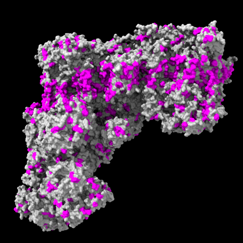
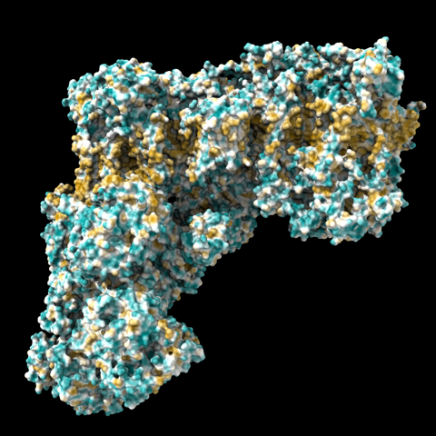
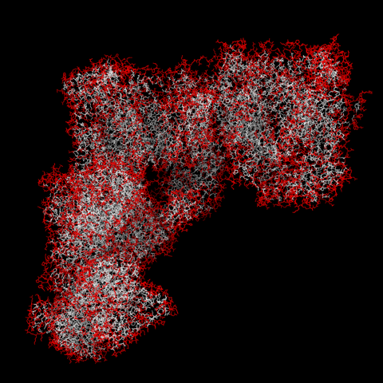

# Surface Exposed Residues

Here is how to select and color surface exposed residues that are hydrophobic.

Use [measure sasa](http://rbvi.ucsf.edu/chimerax/docs/user/commands/measure.html#sasa) to define an "area" attribute of residues, then assign residue hydrophobicities from a file with the [defattr](http://rbvi.ucsf.edu/chimerax/docs/user/commands/defattr.html) command, and then use a single [select](http://rbvi.ucsf.edu/chimerax/docs/user/commands/atomspec.html#attributes) command to intersect these two attributes.  

In the [defattr example files](http://rbvi.ucsf.edu/chimerax/docs/user/commands/defattr.html#examples) I already happened to include a file kdHydrophobicity.txt to assign Kyte-Doolittle hydrophobity, as well as for several other hydrophobicity scales.  Just download whichever one(s) you want.

The commands could be something like:

    open 6g2j
    measure sasa protein
    defattr ~/Desktop/kdHydrophobicity.txt
    select ::area>25 & ::kdHydrophobicity>0.0
    surface protein enclose protein
    color sel magenta

... which looks like this ... 

... in pretty good agreement with MLP coloring, e.g.

    mlp surfaces #1.3

In the select command you may want to experiment with the surface-area and hydrophobicity cutoffs, as well as which hydrophobicity scale you use.  I didn't try a lot of values for surface-area cutoff, but here is with all residues with values >25 colored red, reasonable at least as a first approximation:

Elaine Meng, September 7, 2020
