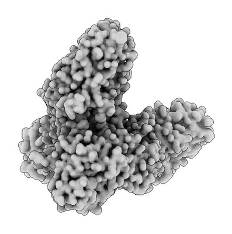
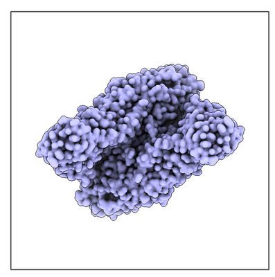

# Align map symmetry axis with z

Tianyang Liu asked on the ChimeraX mailing list how to take a C2 symmetric map with symmetry axis that does not align with x, y, or z axes and make a new map so the symmetry axis aligns with the z axis.  To do this you resample the map on a new 3d grid where the z-axis is parallel the symmetry axis.  This resampling is going to reduce the quality of the map, so I don't advice it.  Instead you the cryoEM single-particle reconstruction software should put the symmetry axis on the z-axis if you want to preserve map quality.  But here is an example how to do the resampling in ChimeraX if you want to.

In this example I make the map from atomic model [PDB 7qa1](https://www.rcsb.org/structure/7QA1) which has symmetry axis approximately along the xy diagonal.  I find the symmetry axis by making two copies of the map, rotating one copy 180 degrees about the approximate axis and fitting it to the first copy.  Once I know the axis direction I tilt one of the copies to make the axis along z, then I center it at 0,0,0 and resample it on a new grid at a slightly finer grid spacing.  Here are the commands I used.  It is a rather tedious process -- there is no special ChimeraX command to do this realignment.

    open 7qa1
    molmap #1 3 gridSpacing 0.8
    close #1
    volume copy #2
    turn 1,1,0 180 model #2
    fit #2 in #1
    > Axis -0.72099508 -0.69293944 0.00101434
    turn 0.69293944,-0.72099508,0 89.942 models #2 coordinateSystem #1
    volume new size 256,256,256 gridSpacing 0.5 origin 0,0,0
    volume #3 showOutlineBox true
    volume #3 originIndex 127.5,127.5,127.5
    measure center #2
    > Center of mass xyz scene coordinates for 7qa1 map 3 = (8.81, -11.79, -28.81)
    move -8.81,11.79,28.81 models #2 coordinateSystem #3
    volume resample #2 onGrid #3
    save aligned.mrc models #4
    
The rotation by 89.942 degrees was from acos(0.00101434), the arc-cosine of the z component of the symmetry axis unit vector z component.  The tilt is done about axis -vy,vx,0 in the xy plane which is perpendicular to the projection of the symmetry axis vx,vy,vz.

<table>
<tr>
<td> Original map with symmetry axis along xy diagonal.</td>
<td> New map with symmetry axis along z.</td>
</tr>
</table>

Tom Goddard, May 22, 2023
