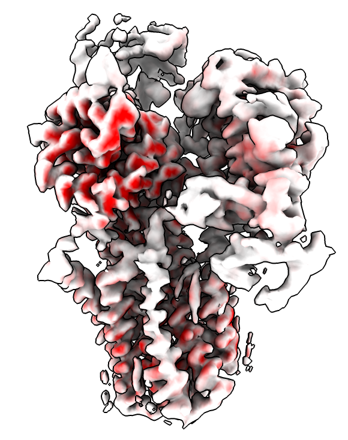

# Compute per-voxel variance of a series of maps

We add a command to compute a map from a series of maps that gives the variance at each grid point.  This can be used for coloring one of the original maps to show where the largest changes occur in the series.  Oliver Clarke asked about this on the ChimeraX mailing list.

As an example, here we color a cryoEM polyamine transporter where two observed conformations differ, EMDB [24220](https://www.ebi.ac.uk/emdb/entry/EMD-24220) and [24221](https://www.ebi.ac.uk/emdb/entry/EMD-24221).

    open 24220 24221 from emdb
    volume variance #1,2
    color sample #2 map #3 palette 0,white:0.02,red
    hide #1,3 models
    volume #2 step 1 level 0.2

Here is the [variance.py](variance.py) code, for ChimeraX 1.2.5 or newer.

    # Create command volume variance to compute variance of a series of maps
    # for coloring regions that change.
    #
    #  volume variance #1-5

    def variance(session, maps):
        sum = sum2 = None
        for v in maps:
            from numpy import float32
            m = v.full_matrix().astype(float32)
            if sum is None:
                sum = m.copy()
                sum2 = m*m
            else:
                if m.shape != sum.shape:
                    from chimerax.core.errors import UserError
                    raise UserError('Map %s' % v.name_with_id() +
                                    ' size (%d,%d,%d)' % tuple(v.data.size) +
                                    ' does not match map %s' % maps[0].name_with_id() +
                                    ' size (%d,%d,%d)' % tuple(maps[0].data.size))
                sum += m
                sum2 += m*m
        n = len(maps)
        var = sum2/n - (sum*sum)/(n*n)
        d = maps[0].data
        from chimerax.map_data import ArrayGridData
        grid = ArrayGridData(var, origin = d.origin, step = d.step,
                             cell_angles = d.cell_angles, rotation = d.rotation,
                             name = 'variance of %d maps' % n)
        from chimerax.map import volume_from_grid_data
        v = volume_from_grid_data(grid, session)
        return v

    def register_command(session):
        from chimerax.core.commands import CmdDesc, register
        from chimerax.map import MapsArg
        desc = CmdDesc(required=[('maps', MapsArg)],
                       synopsis='Compute volume per-pixel variance')
        register('volume variance', desc, variance, logger=session.logger)

    register_command(session)

Tom Goddard, November 24, 2021
