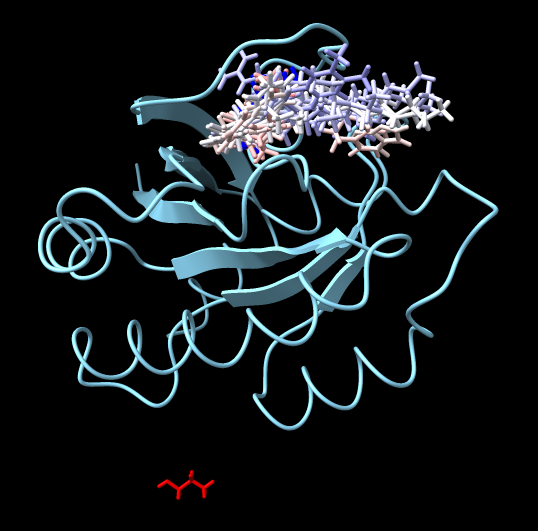

# Make attributes from ViewDockX column information

Here is Python code that converts the column information from the ViewDockX table into corresponding model attributes, which could then be used in [color byattribute](https://www.cgl.ucsf.edu/chimerax/docs/user/commands/color.html#byattribute) or other ChimeraX functions that work on attributes. The names of the generated attrbutes will be shown in the log, and whether they are numeric or non-numeric attributes.  Opening the vdx_attrs.py code in ChimeraX generates the attributes

    open vdx_attrs.py

Here's an example docking output, with the ligands colored based on their generated vdx_Energy_score attribute

Here is the [vdx_attrs.py](vdx_attrs.py) code:

	from chimerax.core.utils import string_to_attr
	attr_names = set()
	numeric_attr_names = set()
	for m in session.models:
		if hasattr(m, 'viewdockx_data'):
			for k, v in m.viewdockx_data.items():
				attr_name = string_to_attr(k, prefix='vdx_')
				if attr_name not in attr_names:
					if isinstance(v, (float, int)):
						kw = { 'attr_type': type(v) }
						numeric_attr_names.add(attr_name)
					else:
						kw = { 'attr_type': str }
					from chimerax.atomic import Structure
					Structure.register_attr(session, attr_name, "ViewDockX attribute script", **kw)
					attr_names.add(attr_name)
				setattr(m, attr_name, v)
	session.logger.info("The following numeric ViewDockX attributes were registered: %s" % ", ".join(sorted(list(numeric_attr_names))))
	session.logger.info("The following non-numeric ViewDockX attributes were registered: %s" % ", ".join(sorted(list(attr_names - numeric_attr_names))))
