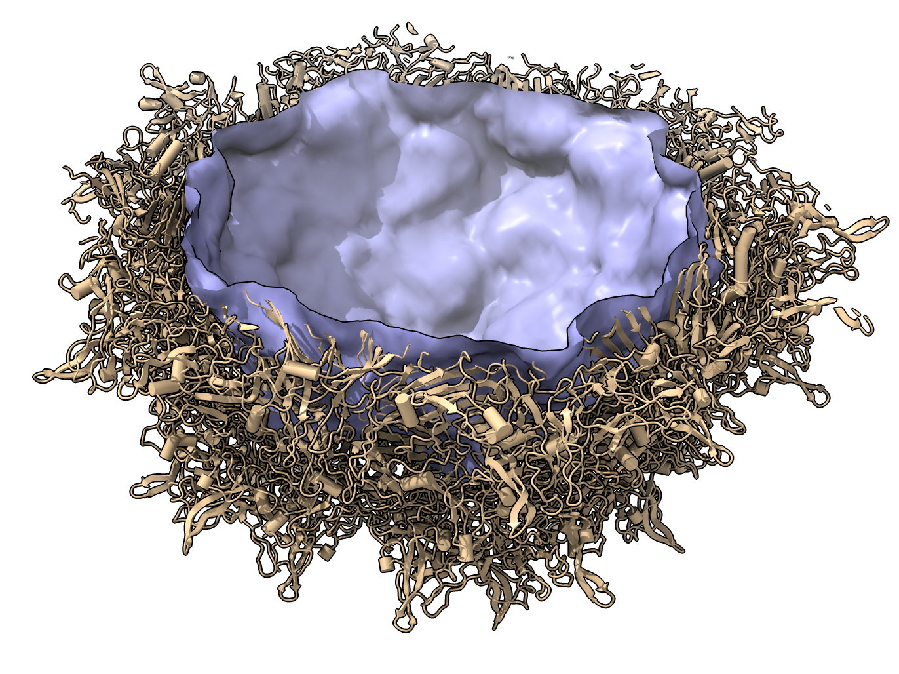

# Measure volume enclosed by a virus capsid

Here is a way to measure the volume (in cubic Angstroms) enclosd by a virus capsid starting from an atomic model.  We will try it on adeno-associated virus PDB [1LP3](https://www.rcsb.org/structure/1LP3).  Heather Noriega [asked](https://plato.cgl.ucsf.edu/pipermail/chimerax-users/2021-November/002866.html) how to do this on the ChimeraX mailing list.

The idea is to make a low resolution (12 Angstrom) density map from the atomic model so there are not holes in the capsid, set the map threshold so there are no holes connecting the inside and outside, then color the outside layer with the "pick blob" mouse mode, then split the surface by color (producing inside and outside surfaces), then measure the volume enclosed by the inside surface.

    open 1LP3
    sym #1 assembly 1 copies true
    molmap #2 12
    volume #3 level 0.676
    # Choose "blob" mouse mode under the "Right Mouse" toolbar tab and right click (command key + trackpad on Mac) the volume surface to color it.
    surface splitbycolor #3.1
    hide #4.1 model
    measure volume #4.2
    -> 2.6 million cubic Angstroms.

Here is what this looks like after clipping to reveal the interior:

This uses the ChimeraX [sym](https://www.cgl.ucsf.edu/chimerax/docs/user/commands/sym.html) command to make the capsid from the asymmetric unit, the [molmap](https://www.cgl.ucsf.edu/chimerax/docs/user/commands/molmap.html) command to make the density map from the atomic model, the [surface splitbycolor](https://www.cgl.ucsf.edu/chimerax/docs/user/commands/surface.html#splitbycolor) command to separate the inside from outside surface of the capsid shell, and the [measure volume](https://www.cgl.ucsf.edu/chimerax/docs/user/commands/measure.html#volume) command to measure enclosed volume.  I clipped the view in half to make the image using the [clip](https://www.cgl.ucsf.edu/chimerax/docs/user/commands/clip.html) command.

Tom Goddard, November 3, 2021